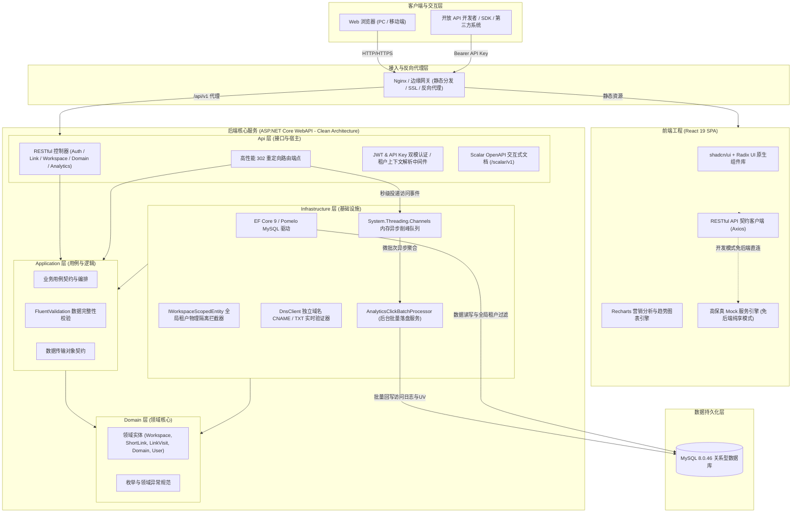

# Arturia.ShortLink

<div align="center">

**现代商业化多租户短链 SaaS 平台**  
*A Modern, High-Performance Multi-Tenant Short Link SaaS Platform*

[](package.json)
[](backend/)
[](frontend/)
[](frontend/)
[](frontend/)
[](frontend/)
[](docs/数据库设计.sql)
[](LICENSE)

[快速开始](#-快速开始-quickstart) • [核心特性](#-核心特性矩阵) • [系统架构](#-系统架构与技术拓扑) • [里程碑进度](#-研发里程碑与双线进度看板) • [AI 协同规范](#-ai-三-agent-协同工程范式) • [文档中心](#-规范文档索引库-docs)

</div>

---

## 📖 项目概述

**Arturia.ShortLink** 是一款企业级、商业化多租户短链 SaaS 平台（对标 Dub.co 与 Bitly），专为现代企业数字化营销、团队品牌短链分发与精准流量归因量身打造。

项目采用现代前后端分离与整洁架构设计：
- **前端体验**：基于 React 19 + TypeScript + Vite + Tailwind CSS + shadcn/ui，遵循极客黑白灰设计哲学，内置全功能高保真 Mock 引擎，可脱离后端完全闭环运行。
- **后端引擎**：基于 .NET 10 (C# 14) + ASP.NET Core WebAPI + MySQL 8.0.46，严格采用标准 **Clean Architecture 4 层结构**与 EF Core 全局租户隔离；利用 `System.Threading.Channels` 进程内异步队列实现高并发削峰批量回写与滑动窗口 UV 去重，**MVP 阶段零 Redis 依赖即可达成极高重定向吞吐与极简运维**。
- **工程范式**：独创 **AI 三 Agent 协同开发体系**（前端 Agent + 后端阶段详细设计 Agent + 后端开发 Agent + 人机交付验收门禁），以严谨的架构对齐、前置深度研读与资产双轨 PR 隔离驱动高质量敏捷迭代。

---

## ✨ 核心特性矩阵

| 模块 | 特性描述 |
| :--- | :--- |
| 🏢 **多租户与工作空间** | 租户物理隔离上下文，支持独立 Slug 空间、RBAC 角色权限体系（Owner / Admin / Member）、成员邀请流转与全局租户过滤。 |
| ⚡ **短链管理与 302 跳转** | Base62 自动发号与自定义个性化短码（Slug）；支持密码保护解锁、设备定向分流（iOS/Android/Desktop）、点击上限与定时自动失效。 |
| 🌐 **独立域名与 DNS 直通** | 支持企业绑定独立自定义域名，提供 CNAME / A 记录自动解析验证与 TXT 归属防劫持校验；系统默认域名与私有域名并存路由。 |
| 📊 **UTM 营销归因与分析** | 全景可视化数据看板；时间序列折线走势、终端设备分布、操作系统、浏览器占比、地理位置热力以及 UTM 5维营销归因深度穿透。 |
| 🎨 **动态二维码个性定制** | 实时渲染矢量二维码，支持前景色/背景色调节、高容错纠错等级（L/M/Q/H）、中心 Logo 嵌入与 SVG/PNG 高清导出。 |
| 🚀 **Channels 异步削峰** | 跳转服务毫秒级 302 直达，依托 `System.Threading.Channels` 进程内高吞吐队列异步解耦，后台批量回写 MySQL 并滑动窗口去重 UV。 |
| 🛡️ **双模安全鉴权与风控** | 纯用户无状态 JWT 令牌与 `art_live_` API Key 开发者凭证双模统一认证；内置黑名单拦截与多级调用限流防护。 |

---

## 🏗️ 系统架构与技术拓扑

### 系统全景架构图



### 技术选型总览

| 维度 | 前端技术栈 (Frontend) | 后端技术栈 (Backend) |
| :--- | :--- | :--- |
| **基础语言与框架** | React 19 + TypeScript 5 + Vite 6 | .NET 10 (C# 14) + ASP.NET Core WebAPI |
| **架构组织** | Feature-First 模块化目录结构 | Clean Architecture 4 层经典架构 |
| **样式与原子设计** | Tailwind CSS 4 + shadcn/ui (New York 风格) | FluentValidation + 统一 JSON 响应规范 |
| **图表与数据可视化** | Recharts 2.x 响应式分析图表库 | DnsClient 1.8 域名解析检测引擎 |
| **数据持久化与 ORM** | LocalStorage (Mock 模式状态持久化) | EF Core 9 + Pomelo.EntityFrameworkCore.MySql 9.0 |
| **数据库** | — | MySQL 8.0.46 (单库物理隔离租户) |
| **API 文档与测试** | TypeScript 严格契约声明 | Scalar.AspNetCore + xUnit + Testcontainers (Docker) |

---

## 🚀 快速开始 (Quickstart)

Arturia.ShortLink 创新支持**双轨启动模式**：你可以无需后端直接体验全功能前端，也可以启动完整全栈进行商业化深度联调。

### 模式 A：前端纯享体验模式 (1 分钟上手，零后端/数据库依赖)

前端已内置完整的高保真 Mock 引擎，支持工作空间创建、租户切换、短链 CRUD、域名绑定验证、图表渲染与数据导出。

```bash
# 1. 克隆代码仓库
git clone https://github.com/ArturiaGit/Arturia.ShortLink.git
cd Arturia.ShortLink/frontend

# 2. 安装前端依赖
npm install

# 3. 启动开发服务器 (默认启用 Mock: VITE_USE_MOCK=true)
npm run dev
```

浏览器访问 **`http://localhost:5173`** 即可立即体验完整的短链 SaaS 管理后台！

---

### 模式 B：全栈本地联调模式 (.NET 10 + MySQL 8.0 + React 19)

#### 1. 前置开发环境要求
- **Node.js**：`>= 20.18.0` (推荐 LTS)
- **.NET SDK**：`10.0.303`（工程根目录已通过 `global.json` 强行锁定版本）
- **MySQL**：`8.0.46`（本地安装或通过 Docker 启动）
- **Docker**（可选）：运行后端集成测试需要 Docker 环境驱动 Testcontainers。

#### 2. 数据库准备
在 MySQL 中创建空数据库（字符集推荐 `utf8mb4`）：
```sql
CREATE DATABASE `arturia_shortlink` DEFAULT CHARACTER SET utf8mb4 COLLATE utf8mb4_unicode_ci;
```

#### 3. 配置与启动后端服务
```bash
# 回到仓库根目录
cd Arturia.ShortLink

# 恢复 dotnet 局部工具 (锁定 dotnet-ef 9.0.20)
dotnet tool restore

# 严格锁定恢复依赖包
dotnet restore backend/Arturia.ShortLink.sln --locked-mode

# 配置数据库连接串 (通过本地 User Secrets 或修改 appsettings.Development.json)
dotnet user-secrets set "ConnectionStrings:DefaultConnection" "Server=localhost;Port=3306;Database=arturia_shortlink;User=root;Password=your_password;" --project backend/src/Arturia.ShortLink.Api
dotnet user-secrets set "Jwt:SecretKey" "your_super_secret_jwt_key_at_least_32_characters_long_123456" --project backend/src/Arturia.ShortLink.Api

# 启动 WebAPI 服务 (默认端口 5000)
dotnet run --project backend/src/Arturia.ShortLink.Api --urls "http://localhost:5000"
```

启动后，在浏览器中打开 **`http://localhost:5000/scalar/v1`** 即可查阅并调试全量交互式 Scalar API 接口文档！

#### 4. 前端对接真实后端
在 `frontend/` 目录下创建 `.env.local` 覆盖配置：
```ini
# 关闭 Mock，直连本地后端
VITE_USE_MOCK=false
VITE_API_BASE_URL="http://localhost:5000/api/v1"
```
随后在 `frontend/` 下执行 `npm run dev`，即可进入真实前后端全栈联调模式。

#### 5. 运行后端自动化门禁测试
```bash
# 运行后端单元测试与集成测试 (包含 MySQL Testcontainers 容器化环境测试)
dotnet test backend/Arturia.ShortLink.sln -c Release
```

---

## 🗺️ 研发里程碑与双线进度看板

项目严格执行前后端双线交付规范，目前最新状态如下：

### 前端交付进度 (React 19 + TypeScript + Mock)

| 阶段 | 核心任务模块 | 状态 | 说明 |
| :---: | :--- | :---: | :--- |
| **Phase 1** | 项目工程搭建、Tailwind CSS 与设计系统基座 | `[x]` 已验收 | 完成 Vite + React 19 脚手架、Zinc 色阶与 Atomic 原子组件初始化 |
| **Phase 2** | 全局布局与多工作空间上下文切换 | `[x]` 已验收 | 完成侧边栏导航、顶栏租户选择器、空间切换与面包屑响应式适配 |
| **Phase 3** | 短链管理核心列表与详情 | `[x]` 已验收 | 完成短链分页列表、多维筛选检索、状态启停、密码保护及创建弹窗 |
| **Phase 4** | 独立域名管理与 DNS 解析走查 | `[x]` 已验收 | 完成独立域名 CRUD、CNAME 与 TXT 记录解析模拟校验及状态标签 |
| **Phase 5** | 营销归因分析看板与数据可视化 | `[x]` 已验收 | 完成时间序列折线图、设备/地理热力占比与 UTM 5 维多指标分析 |
| **Phase 6** | 动态二维码定制与矢量高清导出 | `[x]` 已验收 | 完成前景色/背景色实时拾取、Logo 嵌入、容错等级选择与 SVG/PNG 下载 |
| **Phase 7** | 工作空间设置、成员 RBAC 与邀请流转 | `[ ]` 待执行 | 规划工作空间通用信息修改、成员列表/角色变更、邮箱邀请流与 API Key 生成 |
| **Phase 8** | 认证鉴权、全流程走查与打包加固优化 | `[ ]` 待执行 | 规划用户登录注册状态流转、边界异常兜底、路由守卫与生产包体积优化 |

### 后端交付进度 (.NET 10 WebAPI + Clean Architecture)

| 阶段 | 核心任务模块 | 状态 | 说明 |
| :---: | :--- | :---: | :--- |
| **Phase 1** | 解决方案脚手架、EF Core 迁移与测试底座 | `[x]` 已验收 | 完成 Clean Architecture 4 层搭建、MySQL 种子数据、Scalar 文档与 Testcontainers 底座 |
| **Phase 2** | 用户认证、多租户上下文与工作空间 RBAC | `[x]` 已验收 | 完成纯用户无状态 JWT、全局租户拦截中间件、空间 CRUD、成员邀请与 52 项自动化测试 |
| **Phase 3** | 短链核心映射、自定义别名与 API Key 开放接口 | `[-]` 设计就绪 | 已输出详细设计方案与执行 Prompt；实施 6位 Base62 安全发号、自环风控缓存、SlidingWindow 限流与双模 API Key |
| **Phase 4** | 高性能 302 重定向引擎与 Channels 削峰 | `[ ]` 待执行 | 规划毫秒级重定向端点、System.Threading.Channels 异步削峰、密码 Cookie 解锁、滑动窗口 UV 去重与批量回写 |
| **Phase 5** | 数据分析看板聚合、DNS 真实校验与全链路联调 | `[ ]` 待执行 | 规划数据分析时序/维度看板 API、DnsClient.NET 域名真实校验、关闭 Mock 跨端端到端全链路联调 |

---

## 🤖 AI 三 Agent 协同工程范式

本项目是 **AI-Native 软件工程 (AI-Native Software Engineering)** 的典型实践范例。仓库规范中定义了一套完整的人机协作与三 Agent 分工体系：

```text
                                  ┌─────────────────────────────────────────┐
                                  │          docs/ 核心规范文档库            │
                                  │ (需求说明 / 技术架构 / 接口契约 / 数据库) │
                                  └────────────────────┬────────────────────┘
                                                       │ 契约权威源
             ┌─────────────────────────────────────────┼─────────────────────────────────────────┐
             ▼                                         │ 阶段启动前架构对齐                       ▼
┌─────────────────────────┐                            │ (/grill-me 决议)               ┌─────────────────────────┐
│       前端 Agent        │                            ▼                                │ 后端阶段详细设计 Agent  │
│    (Frontend Agent)     │              ┌───────────────────────────┐                  │ (Backend Design Agent)  │
├─────────────────────────┤              │ 输出《阶段详细设计说明书》 │                  ├─────────────────────────┤
│ • 专职 frontend/ 目录   │              │ + 标准化开发执行 Prompt   │                  │ • 深度技术对齐与方案设计│
│ • Mock 引擎独立闭环     │              └─────────────┬─────────────┘                  │ • 冻结端点、限流与算法  │
│ • 完成大阶段提审验收    │                            │ 前置研读与理解实施方案          └────────────┬────────────┘
└───────────┬─────────────┘                            ▼                                             │
            │                        ┌───────────────────────────────────┐                           │ 交付设计书与Prompt
            │                        │          后端开发 Agent           │◄──────────────────────────┘
            │                        │      (Backend Dev Agent)          │
            │                        ├───────────────────────────────────┤
            │                        │ • 专职 backend/ 编码与测试落地    │
            │                        │ • .NET 10 + Clean Architecture    │
            │                        │ • 严格受限于阶段实施方案与门禁    │
            │                        └─────────────────┬─────────────────┘
            │ 完成阶段验收                             │ 100% 测试通过、Scalar 就绪
            ▼                                          ▼
┌────────────────────────────────────────────────────────────────────────────────────────────────────────┐
│                                   人工验收审阅入口 (Human-in-the-Loop)                                 │
│                  前端: http://localhost:5173   |   后端: http://localhost:5000/scalar/v1               │
├────────────────────────────────────────────────────────────────────────────────────────────────────────┤
│ • 资产双轨 PR 隔离规则：全局规范资产优先独立 PR 合入 main；阶段设计与代码资产特性分支统合 PR 交付     │
│ • 未获用户明确批准前，严禁 commit / push；批准后特性分支自动提交、推送、发起 PR、Squash-merge 并同步主干 │
└────────────────────────────────────────────────────────────────────────────────────────────────────────┘
```

- **行动宪章**：请参阅 [`AGENTS.md`](AGENTS.md) 了解完整的三 Agent 行动宪章、开发纪律与不可协商铁律。
- **双轨 PR 隔离**：全局规范文档（`AGENTS.md`、`README.md`、全局硬性约束等）修改时先单独切 docs 分支提 PR 优先合入主干；阶段设计说明书与代码/测试资产随阶段特性分支统一交付。
- **契约与方案深度研读**：后端开发 Agent 在切出分支动工前，必须先研读宏观规范与阶段实施方案，彻底理解后方可开工。

---

## 📂 目录工程结构拓扑

```text
Arturia.ShortLink/
├── .config/                            # 仓库级 .NET 局部工具配置 (锁定 dotnet-ef)
├── backend/                            # 后端工程 (.NET 10 Clean Architecture)
│   ├── src/
│   │   ├── Arturia.ShortLink.Domain/           # 领域层 (实体、枚举、领域事件)
│   │   ├── Arturia.ShortLink.Application/      # 应用层 (DTO、用例接口、FluentValidation)
│   │   ├── Arturia.ShortLink.Infrastructure/   # 基础设施层 (EF Core、Channels、DnsClient)
│   │   └── Arturia.ShortLink.Api/              # 宿主与接口层 (Controllers、中间件、Program.cs)
│   ├── tests/
│   │   └── Arturia.ShortLink.IntegrationTests/ # 集成测试 (xUnit、Testcontainers MySQL)
│   ├── Arturia.ShortLink.sln                   # Visual Studio / Rider 解决方案文件
│   └── Directory.Packages.props                # NuGet 依赖版本集中管理
├── frontend/                           # 前端工程 (React 19 + Vite + Tailwind CSS)
│   ├── src/
│   │   ├── components/                 # UI 原子组件库 (shadcn/ui New York 风格)
│   │   ├── features/                   # 按业务领域内聚模块 (links, domains, analytics, etc.)
│   │   ├── mock/                       # 高保真 Mock 服务引擎
│   │   └── services/                   # Axios RESTful 契约请求客户端
│   ├── index.html                      # 单页面 HTML 入口
│   └── package.json                    # 前端依赖配置
├── docs/                               # 核心规范与架构设计文档库 (全中文单一事实源)
├── AGENTS.md                           # AI 代理行动宪章与开发指引
├── LICENSE                             # MIT 开源许可证
├── package.json                        # 仓库根元数据与权威版本号 (0.4.0)
└── global.json                         # .NET SDK 强版本锁定 (10.0.303)
```

---

## 📚 规范文档索引库 (`docs/`)

仓库 `docs/` 目录维护了完整的单一事实源规范文档，涵盖系统架构、业务逻辑、接口契约与质量准绳：

| 规范文档 | 文档定位与核心内容 |
| :--- | :--- |
| 📑 [项目全局硬性约束.md](docs/项目全局硬性约束.md) | **【最高宪法】** 技术栈锁定、三 Agent 权责边界与大阶段质量门禁红线。 |
| 📑 [需求规格说明书.md](docs/需求规格说明书.md) | Base62 算法规则、租户物理隔离标准、密码短链解锁与三层风控防刷模型。 |
| 📑 [技术架构说明书.md](docs/技术架构说明书.md) | 全局网络拓扑、毫秒级 302 重定向流转时序、缓存穿透防线与轻量削峰设计。 |
| 📑 [接口契约规范.md](docs/接口契约规范.md) | 统一 WebAPI JSON 响应包装、租户隔离请求头、全量 DTO 数据契约规范。 |
| 📑 [数据库设计.sql](docs/数据库设计.sql) | MySQL 8.0.46 物理建表 DDL、复合唯一索引、字符集设计与初始种子数据。 |
| 📑 [后端详细设计与技术实现说明书.md](docs/后端详细设计与技术实现说明书.md) | Clean Architecture 4 层实操蓝图、Channels 批量落盘机制与 DNS 校验机制。 |
| 📑 [后端阶段二详细设计说明书.md](docs/阶段详细设计/后端阶段二详细设计说明书.md) | 纯用户无状态 JWT 认证、租户中间件强校验、注册双重并存与空间 RBAC 落地。 |
| 📑 [后端阶段三详细设计说明书.md](docs/阶段详细设计/后端阶段三详细设计说明书.md) | 6位安全随机 Base62 发号、平台自环检测与风控缓存、SlidingWindow 多维限流与双模 API Key 凭据设计。 |
| 📑 [前端功能开发清单.md](docs/前端功能开发清单.md) | 前端阶段一至阶段八精细化里程碑与任务清单（前端 Agent 唯一基准）。 |
| 📑 [后端功能开发清单.md](docs/后端功能开发清单.md) | 后端阶段一至阶段五精细化里程碑与任务清单（后端 Agent 唯一基准）。 |
| 📑 [前端UI设计规范.md](docs/前端UI设计规范.md) | New York 预设、极客黑白灰 Zinc 色阶、组件三层分层与 B1~B8 禁令清单。 |
| 📑 [测试与质量验收规范.md](docs/测试与质量验收规范.md) | 浏览器冒烟测试走查表、边界输入验证与大阶段发布质量门禁。 |
| 📑 [Git工作流与Commit规范.md](docs/Git工作流与Commit规范.md) | GitHub Flow、Conventional Commits 规范与人机协同自动 PR 合并闭环。 |
| 📑 [版本管理规范.md](docs/版本管理规范.md) | SemVer 2.0.0 规范、最小版本递增原则与全工程统一版本管理机制。 |
| 📑 [部署与环境配置规范.md](docs/部署与环境配置规范.md) | 环境变量矩阵 (.env)、Vite 生产分包优化、Nginx 反代范本与 Docker 编排。 |

---

## 🤝 参与贡献与 Git 规范

欢迎对本项目提出 Issue 或 Pull Request！在参与开发前，请务必阅读以下准则：

1. **分支策略**：所有开发从最新 `main` 分支切出独立特性分支：`feat/phase-X-<feature-name>`。
2. **Commit 规范**：严格遵守 [Conventional Commits](https://www.conventionalcommits.org/) 规范：
   - `feat(scope): 描述新功能`
   - `fix(scope): 修复缺陷`
   - `docs(scope): 完善文档`
   - `test(scope): 增加或调整测试用例`
   - `refactor(scope): 代码重构`
3. **门禁自检**：
   - 前端提交前必须通过：`npx tsc -b` 与 `npm run build`
   - 后端提交前必须通过：`dotnet build -c Release`、`dotnet test -c Release` 与 `dotnet format --verify-no-changes`

---

## 📄 开源许可证 (License)

本项目基于 [MIT 许可证](LICENSE) 开源，允许商业使用、自由修改与分发，详情请参阅根目录 `LICENSE` 文件。
