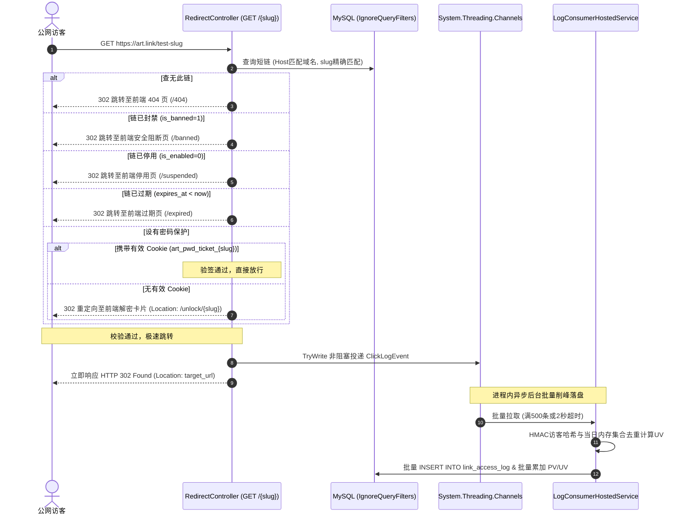

# Arturia.ShortLink - 后端详细设计与技术实现说明书 (Backend Implementation Specification)

本文档为 **Arturia.ShortLink** 平台的后端核心架构蓝图与落地执行技术规格书。  
旨在为**专职后端 AI Agent** 提供零歧义、100% 闭环的工程落地指导，指导其独立构建基于 **.NET 10 + C# ASP.NET Core WebAPI + MySQL 8.0.46** 的商业级多租户短链系统。

---

## 文档概述与修订记录

| 版本 | 修订日期 | 修订人 | 修订说明 |
| :--- | :--- | :--- | :--- |
| **v1.0.0** | 2026-09-14 | AI 代理 (Antigravity) | 基于 `/grill-me` 深度架构决议，初始化端到端后端详细技术实现规格书（Clean Architecture 四层拓扑、多租户 EF Core 全局过滤、Channels 进程内削峰与 IP+UA 字典去重、双模 Bearer 鉴权与 DNS 校验 Bypass 机制） |
| **v1.1.0** | 2026-09-14 | 后端 Agent (Codex) | 冻结后端 MVP 技术实现：全局域名绑定、邀请、软删除与封禁、风险规则、真实 HTTP 状态、MySQL 8.0.46 测试底座及前端既有契约对齐 |
| **v1.2.0** | 2026-09-15 | AI 代理 (Antigravity) | 基于 /grill-me 决议对齐阶段二注册双重并存初始化、个人空间初始 Slug 生成算法及纯用户无状态 JWT 鉴权与租户上下文解耦设计 |
| **v1.3.0** | 2026-09-16 | AI 代理 (Antigravity) | 基于 /grill-me 决议对齐阶段三 6位安全随机 Base62 发号与退避防碰撞、平台自环检测与 IMemoryCache 缓存、SlidingWindow 限流策略及双模 API Key 凭据模型 |
| **v1.4.0** | 2026-09-20 | AI 代理 (Antigravity) | 基于 /grill-me 决议对齐阶段四密码指纹自失效（前8位嵌入 HMAC 载荷）、环境自适应 302 状态页重定向（开发前端端口/生产注册Host白标/防Host注入）、Channels 事务性批量刷盘重试及 UV 字典启动预热与跨天轮转机制 |

---

## 1. 工程总体架构与 .NET 10 解决方案拓扑

后端代码严格采用现代标准的**整洁架构（Clean Architecture）**，在项目根目录下的 `backend/` 目录中创建单一解决方案 `Arturia.ShortLink.sln`，划分为 4 个标准工程：

```text
backend/
├── Arturia.ShortLink.sln                 # .NET 10 解决方案文件
├── Directory.Build.props                 # 全局编译配置 (开启 Nullable 与 TreatWarningsAsErrors)
├── Directory.Packages.props              # NuGet 中央版本锁定，严禁通配版本
├── **/packages.lock.json                 # 各工程 NuGet 依赖锁文件，必须提交
├── compose.dev.yml                       # 项目专属 MySQL 8.0.46 开发容器
├── src/
│   ├── Arturia.ShortLink.Domain/         # 【领域核心层】实体、枚举、业务异常、仓储接口 (0 外部依赖)
│   │   ├── Common/                       # BaseEntity, IWorkspaceScopedEntity
│   │   ├── Entities/                     # 10 个数据库实体，与数据库设计一一对应
│   │   ├── Enums/                        # RoleTier, InvitationStatus, SslStatus, RiskRuleType, DeviceType
│   │   └── Interfaces/                   # ICurrentUserService, IWorkspaceContext
│   │
│   ├── Arturia.ShortLink.Application/    # 【应用服务层】用例接口、DTO契约、FluentValidation 校验、业务服务
│   │   ├── Auth/                         # LoginCommand, RegisterCommand, AuthResponseDto
│   │   ├── Workspaces/                   # CreateWorkspaceDto, MemberDto, WorkspaceService
│   │   ├── Links/                        # CreateLinkDto, UpdateLinkDto, ShortLinkItemDto, Base62Service
│   │   ├── Domains/                      # AddDomainDto, DomainItemDto, IDnsVerificationService
│   │   ├── Analytics/                    # AnalyticsSummaryDto, TimeseriesDto, DeviceStatsDto
│   │   └── ApiKeys/                      # CreateApiKeyDto, ApiKeyItemDto
│   │
│   ├── Arturia.ShortLink.Infrastructure/ # 【基础设施层】EF Core 数据上下文、Fluent API 映射、日志消费、中间件实现
│   │   ├── Persistence/                  # AppDbContext, DbInitializer, EntityConfigurations/
│   │   ├── Authentication/               # JwtTokenService, DualBearerAuthenticationHandler
│   │   ├── Channels/                     # ChannelClickLogWriter, LogConsumerHostedService
│   │   └── Services/                     # DnsVerificationService, SystemTimeService
│   │
│   └── Arturia.ShortLink.Api/            # 【展示接入层】ASP.NET Core 10 WebAPI 控制器、管道配置
│       ├── Controllers/                  # AuthController, WorkspacesController, LinksController, DomainsController, AnalyticsController, ApiKeysController, RedirectController
│       ├── Middlewares/                  # WorkspaceMiddleware, GlobalExceptionMiddleware
│       ├── appsettings.json              # 基础配置模板
│       ├── appsettings.Development.json  # 本地开发配置 (含 Bypass 选项)
│       └── Program.cs                    # 依赖注入配置与 HTTP 管道
│
└── tests/
    └── Arturia.ShortLink.IntegrationTests/ # 自动化集成测试 (基于 WebApplicationFactory)
```

仓库根目录另设 `global.json` 固定稳定版 SDK `10.0.303`，以 `.config/dotnet-tools.json` 锁定与运行时匹配的 `dotnet-ef 9.0.20`，并以根 `package.json` 的 `0.4.0` 为全工程版本唯一权威源。前端版本、`Directory.Build.props`、版本接口和后续 Git Tag 都必须由门禁校验为相同值。

### 1.1 工程间引用依赖规范
* `Domain`：零外部项目依赖，纯 C# 14 基础类型与接口。
* `Application`：仅引用 `Domain`。负责用例组织、业务校验（FluentValidation）与 DTO 映射。
* `Infrastructure`：引用 `Application` 与 `Domain`。负责与 MySQL（EF Core）、网络 DNS、密码散列（BCrypt）与后台线程通道（Channels）交互。
* `Api`：引用 `Infrastructure` 与 `Application`。负责控制器路由分发与依赖注入组装。

---

## 2. 数据库持久化与 EF Core Code-First 实体映射

数据模型严格遵循 `docs/数据库设计.sql` 中定义的表结构、索引与字段约束。采用 **EF Core Code-First** 方案，通过 Fluent API 精确配置映射。

### 2.1 实体映射规范与表名对应

| 实体类名 | 数据库表名 | 复合/核心索引 | 核心职责 |
| :--- | :--- | :--- | :--- |
| `User` | `sys_user` | `uk_email (email)` | 用户主账号、BCrypt 哈希凭据 |
| `Workspace` | `sys_workspace` | `uk_slug (slug)`, `idx_created_by` | 多租户空间隔离主体 |
| `WorkspaceMember` | `sys_workspace_member` | `uk_ws_user (workspace_id, user_id)` | 租户成员关联与 RBAC 角色 (owner/admin/member) |
| `WorkspaceInvitation` | `workspace_invitation` | `uk_ws_pending_email`, `uk_invitation_token_hash` | 7 天一次性待注册邀请与接受状态 |
| `LinkDomain` | `link_domain` | `uk_domain`, `uk_domain_id_system` | 全局唯一 ASCII/Punycode Host、系统域名标记与 DNS 状态 |
| `WorkspaceDomain` | `workspace_domain` | `uk_ws_domain`, `uk_primary_workspace`, `uk_custom_domain_owner` | 租户可用域名绑定、唯一主域名与自定义域名单租户归属 |
| `ShortLink` | `short_link` | `uk_domain_active_slug`, `idx_ws_enabled_created` | 短链元数据、封禁、软删除、PV/UV 与 UTM 参数 |
| `LinkAccessLog` | `link_access_log` | `idx_link_time`, `idx_ws_bot_time`, `idx_utm_campaign_time` | 高频访问明细、访客哈希、机器人与 UTM 快照 |
| `ApiKey` | `sys_api_key` | `uk_key_hash (key_hash)`, `idx_ws_created` | 开放平台集成密钥哈希与权限凭据 |
| `RiskRule` | `risk_rule` | `uk_rule_type_pattern`, `idx_rule_active_type` | 禁止协议、风险域名/关键词、保留 Slug 与机器人 UA 规则 |

### 2.2 全局域名、主域名与短码唯一性

* `link_domain` 是全局域名注册表：规范化 Host 使用小写 ASCII/Punycode，系统域名 `art.link` 只保存一条。
* `workspace_domain` 表示租户可用域名。复合外键 `(domain_id, is_system)` 防止伪造域名类型；生成列 `custom_domain_id` 的唯一索引保证自定义域名只能绑定一个工作空间，系统域名可绑定多个空间；生成列 `primary_workspace_id` 保证每个工作空间最多一个主域名。创建空间时必须在同一事务中绑定系统域名并设为主域名，主域名切换也必须在事务内完成，从而由应用层保证每个有效工作空间至少一个主域名。
* HTTP `DomainDto.id` 与 `{domainId}` 固定映射 `link_domain.id`，不暴露 `workspace_domain.id`；所有域名查询和变更仍必须先以当前 `workspace_id + domain_id` 命中租户绑定，禁止仅凭全局域名 ID 操作。
* `sys_workspace.max_domains` 表示自定义域名配额，系统域名不占额度；`/domains/stats.maxDomains` 为兼容当前前端的“总绑定数/总容量”展示，返回自定义域名配额加当前系统域名绑定数。
* `short_link.slug` 与 `active_slug` 使用 `ascii_bin` 保持 Base62 大小写语义；生成列 `active_slug` 在 `deleted_at IS NULL` 时等于 `slug`，删除后为 `NULL`。唯一索引 `(domain_id, active_slug)` 保证公网 `Host + Slug` 唯一，同时允许软删除后释放原 Slug。
* `short_link` 通过复合外键 `(workspace_id, domain_id)` 引用 `workspace_domain`，数据库层禁止租户使用未绑定域名。
* `WorkspaceDomain.workspace_id` 使用 `ON DELETE RESTRICT`：MySQL 8.0 不允许对被持久化生成列依赖的外键列配置级联动作，且工作空间注销不属于 MVP。
* 自定义域名删除仅允许在该绑定从未产生任何 `short_link` 记录时执行。软删除记录仍通过复合外键保留历史 Host 与归因关系，因此同样阻止删除；允许删除时在事务中先删 `workspace_domain`，再删无其他引用的 `link_domain`。

### 2.3 自动迁移与种子数据填充 (DbInitializer)
为了支持后端 Agent 或新开发者本地“开箱即用（Zero-Config Startup）”，在 `Infrastructure` 层编写 `DbInitializer` 扩展：
1. **环境隔离**：Development/Testing 可在配置显式开启后调用 `Database.MigrateAsync()` 和演示种子；Production 两项默认关闭，由部署迁移任务显式执行。
   * MySQL 容器、迁移会话与应用连接必须显式固定 `+00:00`；应用写入前统一归一化 UTC，禁止依赖宿主机或数据库默认时区。
2. **初始化种子数据**：幂等写入与 `docs/数据库设计.sql` 一致的数据：
   * 演示账号：`admin@arturia.link` 与 `member@arturia.link`，密码均为 `password123!`，BCrypt WorkFactor=11；自动化测试必须用 `BCrypt.Verify` 验证哈希。
   * 2 个默认空间：`Arturia 官方团队` (slug: `arturia-core`, role: `owner`)、`市场增长实验室` (slug: `growth-lab`, role: `owner`)。
   * 全局仅一条系统域名 `art.link`，通过 `workspace_domain` 绑定两个空间；`go.arturia.dev` 唯一归属官方团队。
   * 3 条示例初始短链（`github-repo`, `summer-sale`, `api-docs`）。
   * 恶意协议、平台自环域名、风险域名/关键词、系统保留 Slug 与常见机器人 UA 初始规则。

---

## 3. 多租户上下文提取与 EF Core 全局防越权隔离

### 3.1 租户接口与上下文定义
`WorkspaceMember`、`WorkspaceInvitation`、`WorkspaceDomain`、`ShortLink`、`LinkAccessLog` 与 `ApiKey` 必须实现 `IWorkspaceScopedEntity`：
```csharp
namespace Arturia.ShortLink.Domain.Common;

public interface IWorkspaceScopedEntity
{
    ulong WorkspaceId { get; set; }
}
```

定义作用域服务接口 `IWorkspaceContext`：
```csharp
namespace Arturia.ShortLink.Domain.Interfaces;

public interface IWorkspaceContext
{
    ulong? CurrentWorkspaceId { get; }
    string? CurrentRole { get; }
    void SetContext(ulong workspaceId, string role);
}
```

### 3.2 多租户解析中间件 (`WorkspaceMiddleware`) 与双重并存初始化
中间件拦截需要租户数据的 `/api/v1/*` 管理端请求。登录、注册、`/auth/me`、工作空间列表/创建/Slug 检查、健康检查、公网跳转与密码解锁不依赖当前租户；其中注册采用双重并存初始化、`/auth/me` 和工作空间列表通过受控内部查询读取跨空间邀请或当前用户的全部成员关系：

1. **纯用户无状态 JWT 凭据模型**：
   * JWT Payload 仅包含用户身份声明：`sub` (用户ID)、`email`、`name` (用户昵称)，**严禁固化 `workspace_id` 与 `role`**。
   * 用户在前端随时切换工作空间无需重新签发 Token，角色与成员关系实时从数据库解析生效。
2. **多租户上下文提取与路由一致性校验**：
   * 优先从 HTTP 请求头提取 `X-Workspace-Id`；若请求路由中已包含 `{workspaceId}`（如 `/api/v1/workspaces/{workspaceId}/members/*`）：
     * 若两者均存在且值不一致，立即拦截并返回 HTTP 400 Bad Request（`"请求头 X-Workspace-Id 与路由参数不一致"`）；
     * 目标工作空间 ID 以路由 `{workspaceId}` 为最高准绳。
   * 若 Header 缺失且路由未指定空间，自动回退查询该用户所加入的第一个工作空间作为活跃租户；若用户未加入任何有效空间，返回 HTTP 403 Forbidden。
3. **身份与成员权限校验**：
   * 查询 `sys_workspace_member`，校验当前登录用户（从 JWT Claims 获取）是否归属于该工作空间。若不是成员，直接中断并返回 HTTP 403 Forbidden（`{ "code": 403, "success": false, "message": "无权访问此工作空间" }`）。
4. **注入上下文**：校验成功后，调用 `_workspaceContext.SetContext(workspaceId, member.Role)`。
5. **新用户注册与双重并存初始化规则**：
   * **强制个人工作空间**：新用户注册（`POST /api/v1/auth/register`）时，系统一律为其创建一个独立的个人工作空间（担任 `owner`），名称默认 `"{nickname}的工作空间"`；
   * **个人空间 Slug 自动生成算法**：采用「邮箱前缀规范化 + 4位防重随机短码（如 `user-a7x9`）」，提取邮箱 `@` 前字符，过滤除小写英文字母和数字之外的所有字符；不足 3 位以 `user` 补足，末尾追加 4 位 Base62/字母数字随机短码，检测全局唯一性（若冲突指数退避重试），确保严格符合 `^[a-z0-9](?:[a-z0-9-]{1,30}[a-z0-9])?$`；
   * **系统域名绑定**：在同一事务中为该个人空间绑定全局系统域名 `art.link` 并设为主域名；
   * **原子接受全部有效邀请**：在同一事务中查询该注册邮箱在 `sys_workspace_invitation` 中的待处理记录，将未过期的全部自动接受并创建 `sys_workspace_member` 记录，状态置为 `accepted`；已过期的记录置为 `expired`。注册完成后用户同时拥有个人独立空间与受邀团队空间。

### 3.3 EF Core 全局查询过滤 (Global Query Filter)
在 `AppDbContext.OnModelCreating` 中为每个 `IWorkspaceScopedEntity` 注册等价于下式的过滤器；可使用受测试覆盖的泛型辅助方法生成表达式，不得直接拼接 SQL：
```csharp
modelBuilder.Entity<ApiKey>().HasQueryFilter(entity =>
    CurrentWorkspaceId.HasValue &&
    entity.WorkspaceId == CurrentWorkspaceId.Value);

modelBuilder.Entity<ShortLink>().HasQueryFilter(entity =>
    CurrentWorkspaceId.HasValue &&
    entity.WorkspaceId == CurrentWorkspaceId.Value &&
    entity.DeletedAt == null);
```
* **默认拒绝**：所有租户过滤表达式必须包含 `CurrentWorkspaceId.HasValue`，上下文为空时返回零条租户数据，禁止以 `0` 或首个工作空间静默替代；上例的 `ApiKey` 代表普通租户实体，`ShortLink` 额外包含软删除条件。
* **效果**：所有管理端 CRUD（成员、邀请、域名绑定、短链、访问日志、API 密钥）由 ORM 底层强制附加当前租户条件。
* **绕过机制**：公网跳转引擎（`RedirectController`）通过显式调用 `.IgnoreQueryFilters()` 查询跨租户的公网短链；由于该 API 会同时绕过租户与软删除过滤，查询必须再次显式附加 `DeletedAt == null`。
* **审计要求**：`IgnoreQueryFilters()` 仅允许出现在成员上下文解析（含注册时按邮箱消费全部有效邀请）和公网 Host+Slug 跳转中，并必须附中文注释说明绕过原因、显式补回必要的用户/邮箱、状态及软删除条件。后台消费者不得依赖全局绕过，应按事件携带的 `workspaceId + linkId` 做复合约束写入。

---

## 4. 双模 Bearer 统一鉴权管道 (JWT + API Key)

系统支持人类用户登录控制台与自动化系统调用 OpenAPI，两类凭证均统一通过 HTTP 请求头 `Authorization: Bearer <token>` 传递。

### 4.1 自定义鉴权处理器 (`DualBearerAuthenticationHandler`)
在 ASP.NET Core 管道中注册自定义 `AuthenticationHandler<AuthenticationSchemeOptions>`：
```text
请求到达 ──► 检查 Authorization 头是否为 "Bearer <token>"
                 │
                 ├── 若 token 以 "art_live_" 开头 (开放平台 API Key)
                 │     └── 计算 SHA256(token) ──► 查询 sys_api_key
                 │           ├── 命中且有效 ──► 生成 ClaimsPrincipal (包含 WorkspaceId, UserId=created_by, Role="admin", CredentialType="api_key") ──► 认证成功
                 │           └── 未命中/已过期 ──► 返回 401 Unauthorized
                 │
                 └── 若 token 为标准 JWT (控制台用户)
                       └── 调用 JwtSecurityTokenHandler 进行标准签名与有效期验证 ──► 解析 UserId/Email ──► 认证成功
```

### 4.2 RBAC 细粒度权限控制
在 API 控制器中配置授权策略：
* `[Authorize(Policy = "WorkspaceAdmin")]`：仅限当前空间角色为 `owner` 或 `admin` 的用户访问（如域名管理、成员移除）。
* **短链操作 Member 限制**：在 `UpdateLink`、`DeleteLink`、`ToggleStatus` 中检查：若当前角色为 `member`，且 `link.CreatedBy != currentUserId`，立即拦截并返回 HTTP 403 Forbidden（`"无权限：业务协作者仅可操作本人创建的短链"`）。
* **API Key 租户锁定**：API Key Claims 中的 WorkspaceId 是唯一租户来源；若请求同时携带不同的 `X-Workspace-Id`，直接返回 403，禁止 API Key 跨空间切换。
* **API Key 创建者归属**：API Key 代表空间级自动化主体，但 `short_link.created_by` 仍需满足用户外键与审计语义；因此通过 API Key 创建短链时必须使用该密钥记录不可变的 `created_by`，请求体不得覆盖。
* **API Key 最小授权面**：`CredentialType=api_key` 只通过短链列表、别名检查、创建、更新、启停与删除策略；工作空间、成员、域名、API Key 管理和管理员封禁策略必须要求 `CredentialType=jwt`。不得仅因 API Key 带有 `Role=admin` 就授予全部控制台管理权限。

### 4.3 统一错误与传输约定

* JSON 属性统一为 `camelCase`；数据库 `ulong` 主键在 DTO 中全部输出为十进制字符串；时间输出 UTC ISO 8601。
* 成功使用 HTTP 200/201/202 并返回统一响应体；为兼容当前前端拦截器，成功响应体 `code` 固定为 200。业务失败使用真实 HTTP 400/401/403/404/409/422/429/500，响应体始终为 `{ code, success, message, data }`，失败时 `code` 与 HTTP 状态一致。
* `/health/*` 使用 ASP.NET Core Health Checks 标准响应，OpenAPI/Scalar 使用框架原生文档格式，公网 `GET /{slug}` 仅返回 302 与必要响应头；这些端点是统一业务 JSON 响应体的明确例外。
* 密码哈希、API Key 哈希和短链明文密码永不出现在 DTO、OpenAPI 示例或结构化日志中。

---

## 5. 公网极速 302 重定向与 Channels 进程内削峰消费

### 5.1 短链跳转时序与密码短链闭环 (`GET /{slug}`)


### 5.2 密码解锁端点规范 (`POST /api/v1/links/{slug}/unlock`)
* **逻辑**：访客在前端 `/unlock/{slug}` 卡片输入密码后调用；该公共接口按规范化且已注册的 Host+Slug 唯一定位，不要求 JWT 或 Workspace Header。未知/非法 Host 返回 404，禁止将未经数据库确认的原始 Host 写入票据或响应 URL。
* **实现**：后端查询该短链的 `password_hash`，调用 `BCrypt.Verify(password, password_hash)` 校验。
* **成功响应**：
  * 使用独立安全配置密钥生成绑定规范化 Host、Slug、密码哈希前8位指纹与到期时间的 HMAC-SHA256 Base64Url 票据（载荷 `{domainId}:{slug}:{pwdHash8}:{expiresAt}`），验签采用固定时间比较；若密码被修改或移除，历史票据自动失效；不得复用 JWT 或访客哈希密钥。
  * 写入 Header：`Set-Cookie: art_pwd_ticket_{slug}={ticket}; Path=/; Max-Age=1800; HttpOnly; SameSite=Lax`；Production 必须追加 `Secure`。
  * 返回 `{ "code": 200, "success": true, "data": { "originalUrl": "https://...", "ticket": "..." } }`。

### 5.3 Channels 进程内缓冲与 IP+UA 字典去重
为了消除对外部 Redis 的硬性依赖，支持轻量级单机单体部署：
1. **缓冲通道**：初始化单例 `Channel<ClickLogEvent>.CreateBounded(new BoundedChannelOptions(50000) { FullMode = BoundedChannelFullMode.Wait })`。重定向方法只调用非阻塞 `_channel.Writer.TryWrite(event)`；满载时返回 `false` 并递增脱敏丢弃指标，不等待队列空位。
2. **当日 UV 内存去重算法**：
   * 使用来自安全配置、按 UTC 日期派生的密钥计算 `HMAC-SHA256(规范化IP字节 + User-Agent)`，禁止无密钥 MD5/SHA256；日志仅保存哈希，不把哈希当作可逆身份标识。
   * 进程内维护 `ConcurrentDictionary<string, byte>`，键名格式为：`uv:{linkId}:{yyyyMMdd}:{visitorHash}`。
   * 消费事件时，调用 `_uvDict.TryAdd(key, 0)`。若返回 `true`，说明该访客为今日首次访问该短链，标记 `isNewUv = 1`；若返回 `false`，则仅计入 PV，`isNewUv = 0`。
   * 服务启动时异步预热：从当日 `link_access_log`（`created_at >= @TodayUtcMidnight AND is_bot = 0`）加载去重哈希重建集合，跨重启保持单实例 UV 口径绝对连续；每日 UTC 00:00 清理过期条目并派生新日密钥。
3. **批量落盘 HostedService (`LogConsumerHostedService : BackgroundService`)**：
   * 循环从 Channel 读取事件，当累积达到 **500 条** 或达到 **2 秒** 定时器阈值时，在单一数据库事务中执行批量写入：
     * 批量向 `link_access_log` 执行多行 `INSERT`；
     * 按 `linkId` 汇总本次批次的 `totalPv` 与 `totalUv`，执行原子批量更新：`UPDATE short_link SET total_clicks = total_clicks + @pv, total_unique_visitors = total_unique_visitors + @uv WHERE id = @id`；
     * 支持最多 3 次指数退避容灾重试（50ms, 100ms, 200ms），降级记录结构化告警而不崩溃 BackgroundService。
4. **机器人与归因快照**：访问事件先匹配启用的 `bot_user_agent` 规则；机器人允许跳转并写入 `is_bot`/`bot_name`，但不累加商业 PV/UV。日志同时固化五项 UTM 快照，供历史归因稳定聚合。
5. **终端与地域富化**：后台消费者使用受单元测试覆盖的内置 UA 特征解析器产出设备/系统/浏览器，不引入授权不明的 UA 规则库；GeoIP 通过可替换 `IGeoLocationResolver` 在短超时内解析。解析器未配置、超时、网络或数据源失败时写入“未知地域”，不得重试阻塞 Channel，也不得导致公网跳转或批量落盘失败。
6. **可用性边界与优雅停机**：业务 PV 仍定义为每次非机器人成功跳转；MVP 为保证跳转不阻塞，日志投递采用进程内尽力而为语义，满载或异常丢弃会造成统计偏差，因此必须进入监控指标。HostedService 收到停止信号后完成 Channel 读取并刷新剩余批次；指标不得记录 IP、UA 或凭据原文。

### 5.4 安全风控与限流

* `risk_rule` 是禁止协议、风险域名/关键词、保留 Slug 和机器人 UA 的数据库事实源；服务端使用短时内存缓存并支持失效刷新，不依赖 Redis。
* 目标 URL 仅允许 HTTP/HTTPS，阻断平台系统域名及全部已绑定自定义域名形成的自环；规则命中返回 422。
* ASP.NET Core Rate Limiter 默认分区：登录/解锁 10 次/分钟/IP，短链创建 30 次/分钟/用户或 API Key，公网跳转 120 次/分钟/IP；触发时返回 HTTP 429 与统一错误体。
* Host 必须先严格规范化并命中 `link_domain`；状态页 Location 使用持久化域名构造，未知 Host 使用配置的规范平台 404 URL，防止 Host Header 注入形成外部重定向。
* `UseForwardedHeaders` 仅信任配置的 Nginx/网关地址或网段，清空默认宽松转发并限制转发层数；限流、访客哈希和审计 IP 禁止信任任意客户端伪造的 `X-Forwarded-For`。

---

## 6. 自定义域名真实 DNS 探测与开发直通机制

### 6.1 DnsClient.NET 校验逻辑
针对 `POST /api/v1/domains/{domainId}/verify` 接口：
1. 查询当前要验证的域名记录，获取其绑定的 `verification_code`。
2. 使用 `DnsClient.LookupClient` 解析目标二级域名的 CNAME 记录是否指向平台默认共享域名（如 `art.link`），或者查询 TXT 记录是否匹配 `verification_code`。
3. 若解析匹配，将 `is_verified` 更新为 1，`ssl_status` 更新为 `Active`。

### 6.2 本地/测试环境直通开关 (`BypassInDevelopment`)
为了避免在本地联调和集成测试时因真实公网 DNS 解析失败而受阻，在 `appsettings.Development.json` 中配置：
```json
{
  "DomainVerification": {
    "BypassInDevelopment": true,
    "ExpectedCnameTarget": "art.link"
  }
}
```
* **实现规则**：后端在处理 `verify` 请求时，优先检查 `DomainVerification:BypassInDevelopment`。若为 `true`，直接跳过真实 DNS 网络查询，将域名状态更新为已验证通过，极大方便端到端自动化测试。
* **SSL 证书生命周期声明**：后端数据库中的 `ssl_status` 仅作为对外状态标识；真正的 HTTPS 证书签发与 SSL 握手由前置的反向代理网关（Nginx / Caddy / Cloudflare）接管。

---

## 7. 依赖库锁定清单与质量验收门禁

### 7.1 核心 NuGet 依赖包版本锁定 (.NET 10)
```xml
<!-- Directory.Packages.props；各 csproj 的 PackageReference 不再写 Version -->
<PackageVersion Include="Pomelo.EntityFrameworkCore.MySql" Version="9.0.0" />
<PackageVersion Include="Microsoft.EntityFrameworkCore" Version="9.0.20" />
<PackageVersion Include="Microsoft.EntityFrameworkCore.Design" Version="9.0.20" />
<PackageVersion Include="BCrypt.Net-Next" Version="4.2.1" />
<PackageVersion Include="DnsClient" Version="1.8.0" />
<PackageVersion Include="FluentValidation.AspNetCore" Version="11.3.1" />
<PackageVersion Include="Microsoft.AspNetCore.Authentication.JwtBearer" Version="10.0.12" />
<PackageVersion Include="Microsoft.AspNetCore.OpenApi" Version="10.0.12" />
<PackageVersion Include="Scalar.AspNetCore" Version="2.17.3" />
<PackageVersion Include="Microsoft.AspNetCore.Mvc.Testing" Version="10.0.12" />
<PackageVersion Include="Microsoft.NET.Test.Sdk" Version="18.10.0" />
<PackageVersion Include="Testcontainers.MySql" Version="4.15.0" />
<PackageVersion Include="xunit" Version="2.9.3" />
<PackageVersion Include="xunit.runner.visualstudio" Version="3.1.5" />
```

以上版本在 `Directory.Packages.props` 中集中锁定，并启用 `RestorePackagesWithLockFile`。Phase 1 首次使用普通 restore 生成各工程 `packages.lock.json` 后必须提交锁文件，后续验收与 CI 一律使用 `--locked-mode`；集成测试数据库固定 `mysql:8.0.46`，不得使用 SQLite、EF InMemory、`mysql:latest` 或本机非 8.x 容器替代数据库语义验证。

### 7.2 后端 Agent 交付与验收质量门禁 (Definition of Done)
后端 Agent 在完成任一大阶段时，必须通过以下刚性门禁：
1. **工具链与恢复**：运行 `dotnet --version`、`dotnet tool restore` 与 `dotnet tool run dotnet-ef --version`，确认稳定版 SDK `10.0.303` 和本地 EF 工具 `9.0.20`，再执行 `dotnet restore backend/Arturia.ShortLink.sln --locked-mode`。
2. **静态编译检查**：运行 `dotnet build backend/Arturia.ShortLink.sln -c Release --no-restore`，确保 **0 警告、0 报错**。
3. **自动化测试与格式**：运行 `dotnet test backend/Arturia.ShortLink.sln -c Release --no-build` 与 `dotnet format backend/Arturia.ShortLink.sln --verify-no-changes`，保证 0 失败、0 取消、0 跳过且格式无差异。
4. **自动唤起浏览器审查**：启动 Kestrel 服务，使用 `Start-Process "http://localhost:5000/scalar/v1"` 主动打开 Scalar 供人工体验与核验。
5. **人工确认与 PR 合并闭环**：在获得用户明确同意前**绝对严禁提交或推送**；获批后先在特性分支勾选《后端功能开发清单.md》并追加修订记录，再复跑门禁和密钥扫描、提交推送、创建 PR 与 Squash 合并。切回 `main` 后验证清单已同步且工作区干净，并**立即原地暂停**等待下一指令。
