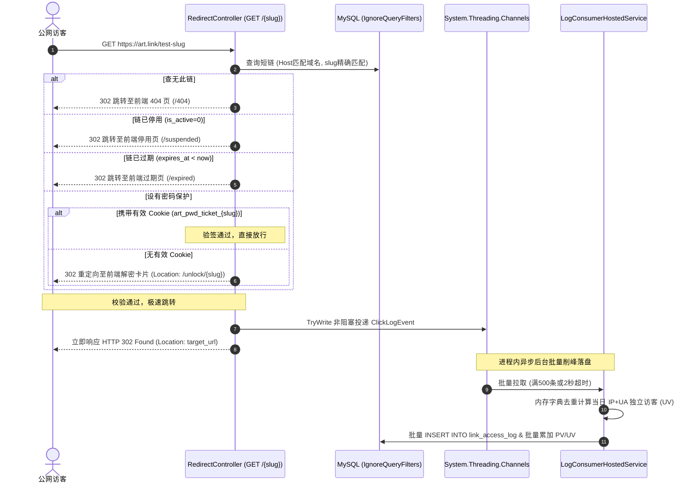

# Arturia.ShortLink - 后端详细设计与技术实现说明书 (Backend Implementation Specification)

本文档为 **Arturia.ShortLink** 平台的后端核心架构蓝图与落地执行技术规格书。  
旨在为后续**专职后端 AI Agent** 提供零歧义、100% 闭环的工程落地指导，指导其在无需人类干预的情况下独立构建基于 **.NET 10 + C# ASP.NET Core WebAPI + MySQL 8.x** 的商业级多租户短链系统。

---

## 文档概述与修订记录

| 版本 | 修订日期 | 修订人 | 修订说明 |
| :--- | :--- | :--- | :--- |
| **v1.0.0** | 2026-09-14 | AI 代理 (Antigravity) | 基于 `/grill-me` 深度架构决议，初始化端到端后端详细技术实现规格书（Clean Architecture 四层拓扑、多租户 EF Core 全局过滤、Channels 进程内削峰与 IP+UA 字典去重、双模 Bearer 鉴权与 DNS 校验 Bypass 机制） |

---

## 1. 工程总体架构与 .NET 10 解决方案拓扑

后端代码严格采用现代标准的**整洁架构（Clean Architecture）**，在项目根目录下的 `backend/` 目录中创建单一解决方案 `Arturia.ShortLink.sln`，划分为 4 个标准工程：

```text
backend/
├── Arturia.ShortLink.sln                 # .NET 10 解决方案文件
├── Directory.Build.props                 # 全局编译配置 (开启 Nullable 与 TreatWarningsAsErrors)
├── src/
│   ├── Arturia.ShortLink.Domain/         # 【领域核心层】实体、枚举、业务异常、仓储接口 (0 外部依赖)
│   │   ├── Common/                       # BaseEntity, IWorkspaceScopedEntity
│   │   ├── Entities/                     # User, Workspace, WorkspaceMember, LinkDomain, ShortLink, LinkAccessLog, ApiKey
│   │   ├── Enums/                        # RoleTier (owner/admin/member), SslStatus, DeviceType
│   │   └── Interfaces/                   # ICurrentUserService, IWorkspaceContext
│   │
│   ├── Arturia.ShortLink.Application/    # 【应用服务层】用例接口、DTO契约、FluentValidation 校验、业务服务
│   │   ├── Auth/                         # LoginCommand, RegisterCommand, AuthResponseDto
│   │   ├── Workspaces/                   # CreateWorkspaceDto, MemberDto, WorkspaceService
│   │   ├── Links/                        # CreateLinkDto, UpdateLinkDto, ShortLinkItemDto, Base62Service
│   │   ├── Domains/                      # AddDomainDto, DomainItemDto, IDnsVerificationService
│   │   ├── Analytics/                    # AnalyticsSummaryDto, TimeseriesDto, DeviceStatsDto
│   │   └── ApiKeys/                      # CreateApiKeyDto, ApiKeyItemDto
│   │
│   ├── Arturia.ShortLink.Infrastructure/ # 【基础设施层】EF Core 数据上下文、Fluent API 映射、日志消费、中间件实现
│   │   ├── Persistence/                  # AppDbContext, DbInitializer, EntityConfigurations/
│   │   ├── Authentication/               # JwtTokenService, DualBearerAuthenticationHandler
│   │   ├── Channels/                     # ChannelClickLogWriter, LogConsumerHostedService
│   │   └── Services/                     # DnsVerificationService, SystemTimeService
│   │
│   └── Arturia.ShortLink.Api/            # 【展示接入层】ASP.NET Core 10 WebAPI 控制器、管道配置
│       ├── Controllers/                  # AuthController, WorkspacesController, LinksController, DomainsController, AnalyticsController, ApiKeysController, RedirectController
│       ├── Middlewares/                  # WorkspaceMiddleware, GlobalExceptionMiddleware
│       ├── appsettings.json              # 基础配置模板
│       ├── appsettings.Development.json  # 本地开发配置 (含 Bypass 选项)
│       └── Program.cs                    # 依赖注入配置与 HTTP 管道
│
└── tests/
    └── Arturia.ShortLink.IntegrationTests/ # 自动化集成测试 (基于 WebApplicationFactory)
```

### 1.1 工程间引用依赖规范
* `Domain`：零外部项目依赖，纯 C# 14 基础类型与接口。
* `Application`：仅引用 `Domain`。负责用例组织、业务校验（FluentValidation）与 DTO 映射。
* `Infrastructure`：引用 `Application` 与 `Domain`。负责与 MySQL（EF Core）、网络 DNS、密码散列（BCrypt）与后台线程通道（Channels）交互。
* `Api`：引用 `Infrastructure` 与 `Application`。负责控制器路由分发与依赖注入组装。

---

## 2. 数据库持久化与 EF Core Code-First 实体映射

数据模型严格遵循 `docs/数据库设计.sql` 中定义的表结构、索引与字段约束。采用 **EF Core Code-First** 方案，通过 Fluent API 精确配置映射。

### 2.1 实体映射规范与表名对应

| 实体类名 | 数据库表名 | 复合/核心索引 | 核心职责 |
| :--- | :--- | :--- | :--- |
| `User` | `sys_user` | `uk_email (email)` | 用户主账号、BCrypt 哈希凭据 |
| `Workspace` | `sys_workspace` | `uk_slug (slug)`, `idx_created_by` | 多租户空间隔离主体 |
| `WorkspaceMember` | `sys_workspace_member` | `uk_ws_user (workspace_id, user_id)` | 租户成员关联与 RBAC 角色 (owner/admin/member) |
| `LinkDomain` | `link_domain` | `uk_domain (domain)`, `idx_workspace_id` | 自定义域名解析状态与 CNAME/TXT 校验码 |
| `ShortLink` | `short_link` | `uk_domain_slug (domain_id, slug)`, `idx_ws_active_created` | 短链核心元数据、PV/UV 聚合计数、UTM 参数 |
| `LinkAccessLog` | `link_access_log` | `idx_link_time`, `idx_ws_time`, `idx_time` | 高频访问时序日志明细（访客 IP、UA、地域等） |
| `ApiKey` | `sys_api_key` | `uk_key_hash (key_hash)`, `idx_ws_created` | 开放平台集成密钥哈希与权限凭据 |

### 2.2 自动迁移与种子数据填充 (DbInitializer)
为了支持后端 Agent 或新开发者本地“开箱即用（Zero-Config Startup）”，在 `Infrastructure` 层编写 `DbInitializer` 扩展：
1. **自动执行迁移**：在应用启动管道中（`Program.cs`），调用 `await dbContext.Database.MigrateAsync()` 自动建立所有数据表与索引。
2. **初始化种子数据**：若 `sys_user` 为空，自动注入与 `docs/数据库设计.sql` 完全一致的初始种子：
   * 默认超管账号：`admin@arturia.com`，密码哈希为 `demo123456` 的 BCrypt 结果（`$2a$11$N9qo8uLOickgx2ZMRZoMyeIjZAgcfl7p92ldGxad68LJZdL17lhWy`）。
   * 2 个默认空间：`Arturia 官方团队` (slug: `arturia-core`, role: `owner`)、`市场增长实验室` (slug: `growth-lab`, role: `owner`)。
   * 默认域名：绑定系统共享域名 `art.link`（已激活 `active`）及自定义域名 `go.arturia.dev`。
   * 3 条示例初始短链（`github-repo`, `summer-sale`, `api-docs`）。

---

## 3. 多租户上下文提取与 EF Core 全局防越权隔离

### 3.1 租户接口与上下文定义
所有归属于特定工作空间的实体必须实现 `IWorkspaceScopedEntity`：
```csharp
namespace Arturia.ShortLink.Domain.Common;

public interface IWorkspaceScopedEntity
{
    ulong WorkspaceId { get; set; }
}
```

定义作用域服务接口 `IWorkspaceContext`：
```csharp
namespace Arturia.ShortLink.Domain.Interfaces;

public interface IWorkspaceContext
{
    ulong? CurrentWorkspaceId { get; }
    string? CurrentRole { get; }
    void SetContext(ulong workspaceId, string role);
}
```

### 3.2 多租户解析中间件 (`WorkspaceMiddleware`)
中间件拦截所有 `/api/v1/*` 管理端请求（排除公共跳转路由 `GET /{slug}` 与认证登录接口）：
1. **提取租户 ID**：优先从 HTTP 请求头提取 `X-Workspace-Id`。
2. **身份与成员校验**：
   * 若 Header 存在有效 `X-Workspace-Id`：查询 `sys_workspace_member`，校验当前登录用户（从 JWT Claims 获取）是否归属于该工作空间。若不是成员，直接中断并返回 HTTP 403 Forbidden（`{ "code": 403, "success": false, "message": "无权访问此工作空间" }`）。
   * 若 Header 缺失：自动回退查询该用户所加入的第一个工作空间作为当前活跃租户。
3. **注入上下文**：校验成功后，调用 `_workspaceContext.SetContext(workspaceId, member.Role)`。

### 3.3 EF Core 全局查询过滤 (Global Query Filter)
在 `AppDbContext.OnModelCreating` 中配置全局过滤：
```csharp
foreach (var entityType in modelBuilder.Model.GetEntityTypes())
{
    if (typeof(IWorkspaceScopedEntity).IsAssignableFrom(entityType.ClrType))
    {
        var parameter = Expression.Parameter(entityType.ClrType, "e");
        var property = Expression.Property(parameter, nameof(IWorkspaceScopedEntity.WorkspaceId));
        var filter = Expression.Lambda(
            Expression.Equal(property, Expression.Property(Expression.Constant(this), nameof(CurrentWorkspaceId))),
            parameter
        );
        modelBuilder.Entity(entityType.ClrType).HasQueryFilter(filter);
    }
}
```
* **效果**：所有管理端 CRUD（查询短链、域名、API 密钥）由 ORM 底层强制附加 `WHERE workspace_id = @currentWorkspaceId`，彻底杜绝越权数据泄漏。
* **绕过机制**：公网跳转引擎（`RedirectController`）通过显式调用 `.IgnoreQueryFilters()` 查询跨租户的公网短链。

---

## 4. 双模 Bearer 统一鉴权管道 (JWT + API Key)

系统支持人类用户登录控制台与自动化系统调用 OpenAPI，两类凭证均统一通过 HTTP 请求头 `Authorization: Bearer <token>` 传递。

### 4.1 自定义鉴权处理器 (`DualBearerAuthenticationHandler`)
在 ASP.NET Core 管道中注册自定义 `AuthenticationHandler<AuthenticationSchemeOptions>`：
```text
请求到达 ──► 检查 Authorization 头是否为 "Bearer <token>"
                 │
                 ├── 若 token 以 "art_live_" 开头 (开放平台 API Key)
                 │     └── 计算 SHA256(token) ──► 查询 sys_api_key
                 │           ├── 命中且有效 ──► 生成 ClaimsPrincipal (包含 WorkspaceId, Role="admin") ──► 认证成功
                 │           └── 未命中/已过期 ──► 返回 401 Unauthorized
                 │
                 └── 若 token 为标准 JWT (控制台用户)
                       └── 调用 JwtSecurityTokenHandler 进行标准签名与有效期验证 ──► 解析 UserId/Email ──► 认证成功
```

### 4.2 RBAC 细粒度权限控制
在 API 控制器中配置授权策略：
* `[Authorize(Policy = "WorkspaceAdmin")]`：仅限当前空间角色为 `owner` 或 `admin` 的用户访问（如域名管理、成员移除）。
* **短链操作 Member 限制**：在 `UpdateLink`、`DeleteLink`、`ToggleStatus` 中检查：若当前角色为 `member`，且 `link.CreatedBy != currentUserId`，立即拦截并返回 HTTP 403 Forbidden（`"无权限：业务协作者仅可操作本人创建的短链"`）。

---

## 5. 公网极速 302 重定向与 Channels 进程内削峰消费

### 5.1 短链跳转时序与密码短链闭环 (`GET /{slug}`)


### 5.2 密码解锁端点规范 (`POST /api/v1/links/{slug}/unlock`)
* **逻辑**：访客在前端 `/unlock/{slug}` 卡片输入密码后调用。
* **实现**：后端查询该短链的 `password_hash`，调用 `BCrypt.Verify(password, password_hash)` 校验。
* **成功响应**：
  * 生成短期防篡改票据 `ticket = HMAC_SHA256(slug + timestamp, secret)`。
  * 写入 Header：`Set-Cookie: art_pwd_ticket_{slug}={ticket}; Path=/; Max-Age=1800; HttpOnly; SameSite=Lax`。
  * 返回 `{ "code": 200, "success": true, "data": { "originalUrl": "https://...", "ticket": "..." } }`。

### 5.3 Channels 进程内缓冲与 IP+UA 字典去重
为了消除对外部 Redis 的硬性依赖，支持轻量级单机单体部署：
1. **缓冲通道**：初始化单例 `Channel<ClickLogEvent>.CreateBounded(new BoundedChannelOptions(50000) { FullMode = BoundedChannelFullMode.DropWrite })`。在重定向方法中调用 `_channel.Writer.TryWrite(event)`，耗时小于 0.1ms。
2. **当日 UV 内存去重算法**：
   * 进程内维护 `ConcurrentDictionary<string, byte>`，键名格式为：`uv:{linkId}:{yyyyMMdd}:{MD5(ip + userAgent)}`。
   * 消费事件时，调用 `_uvDict.TryAdd(key, 0)`。若返回 `true`，说明该访客为今日首次访问该短链，标记 `isNewUv = 1`；若返回 `false`，则仅计入 PV，`isNewUv = 0`。
   * 后台设置每日凌晨自动清空前一天的过期字典条目，避免内存膨胀。
3. **批量落盘 HostedService (`LogConsumerHostedService : BackgroundService`)**：
   * 循环从 Channel 读取事件，当累积达到 **500 条** 或达到 **2 秒** 定时器阈值时，执行一次批量写入：
     * 批量向 `link_access_log` 执行多行 `INSERT`；
     * 按 `linkId` 汇总本次批次的 `totalPv` 与 `totalUv`，执行批量更新：`UPDATE short_link SET total_clicks = total_clicks + @pv, total_unique_visitors = total_unique_visitors + @uv WHERE id = @id`。

---

## 6. 自定义域名真实 DNS 探测与开发直通机制

### 6.1 DnsClient.NET 校验逻辑
针对 `POST /api/v1/domains/{domainId}/verify` 接口：
1. 查询当前要验证的域名记录，获取其绑定的 `verification_code`。
2. 使用 `DnsClient.LookupClient` 解析目标二级域名的 CNAME 记录是否指向平台默认共享域名（如 `art.link`），或者查询 TXT 记录是否匹配 `verification_code`。
3. 若解析匹配，将 `is_verified` 更新为 1，`ssl_status` 更新为 `active`。

### 6.2 本地/测试环境直通开关 (`BypassInDevelopment`)
为了避免在本地联调和集成测试时因真实公网 DNS 解析失败而受阻，在 `appsettings.Development.json` 中配置：
```json
{
  "DomainVerification": {
    "BypassInDevelopment": true,
    "ExpectedCnameTarget": "art.link"
  }
}
```
* **实现规则**：后端在处理 `verify` 请求时，优先检查 `DomainVerification:BypassInDevelopment`。若为 `true`，直接跳过真实 DNS 网络查询，将域名状态更新为已验证通过，极大方便端到端自动化测试。
* **SSL 证书生命周期声明**：后端数据库中的 `ssl_status` 仅作为对外状态标识；真正的 HTTPS 证书签发与 SSL 握手由前置的反向代理网关（Nginx / Caddy / Cloudflare）接管。

---

## 7. 依赖库锁定清单与质量验收门禁

### 7.1 核心 NuGet 依赖包版本锁定 (.NET 10)
```xml
<!-- Infrastructure 工程依赖 -->
<PackageReference Include="Pomelo.EntityFrameworkCore.MySql" Version="9.0.0-*" />
<PackageReference Include="BCrypt.Net-Next" Version="4.0.3" />
<PackageReference Include="DnsClient" Version="1.8.0" />

<!-- Application 工程依赖 -->
<PackageReference Include="FluentValidation.AspNetCore" Version="11.3.0" />

<!-- Api 工程依赖 -->
<PackageReference Include="Microsoft.AspNetCore.Authentication.JwtBearer" Version="10.0.0-*" />
<PackageReference Include="Scalar.AspNetCore" Version="2.0.0-*" />
```

### 7.2 后端 Agent 交付与验收质量门禁 (Definition of Done)
后端 Agent 在完成任一大阶段时，必须通过以下 4 项刚性门禁：
1. **静态编译检查**：在终端运行 `dotnet build`，确保 **0 警告、0 报错**（依赖 `<TreatWarningsAsErrors>true</TreatWarningsAsErrors>` 强制约束）。
2. **自动化测试覆盖**：在 `tests/Arturia.ShortLink.IntegrationTests` 中运行 `dotnet test`，保证全部测试用例绿灯通过。
3. **自动唤起浏览器审查**：启动 Kestrel 服务，使用系统命令（`Start-Process "http://localhost:5000/scalar/v1"` 或 `/swagger`）**主动打开用户默认浏览器展现交互式 API 文档**供人工体验与核验。
4. **人工确认与 PR 合并闭环**：在获得用户明确同意前**绝对严禁提交或推送**；获批后按 Conventional Commits 规范向特性分支（`feat/phase-X-<name>`）提交推送，使用 `gh pr create` 创建 PR 并调用 `gh pr merge --squash --delete-branch` 完成自动合并，切回 `main` 同步，在《后端功能开发清单.md》中勾选 `[x]` 并**立即原地暂停**等待下一指令。
