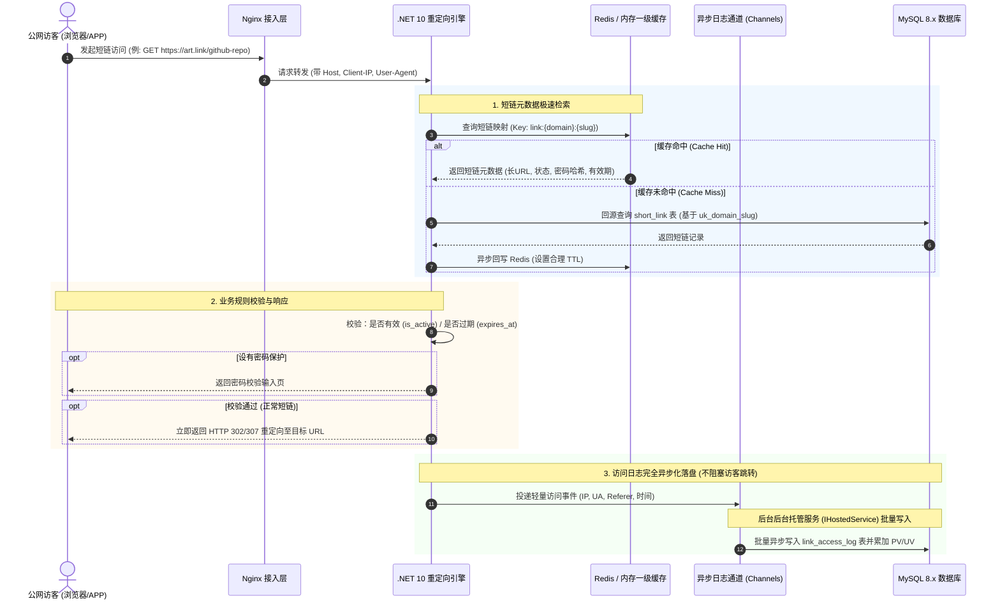

# 技术架构说明书 (Technical Architecture Specification)

本文档定义 **Arturia.ShortLink** 平台的端到端技术拓扑、底层高并发数据流、公网短链毫秒级 302 重定向机制与缓存防击穿架构。  
旨在为前端构建与**你后续手动编写 .NET 10 + C# WebAPI + MySQL 后端**提供全景技术架构蓝图与工程设计依据。

---

## 1. 系统总体技术拓扑图

短链系统是典型的**“读多写少、读写比通常达 50:1 以上”**的高吞吐 Web 系统。系统在逻辑与物理层面划分为管理控制台端与公网极速跳转端：

```mermaid
flowchart TB
    subgraph Clients["客户端层 (Clients)"]
        A1["管理员/运营人员 (Web 控制台)"]
        A2["公网真实访客 (短链点击)"]
        A3["第三方集成系统 (OpenAPI / Token)"]
    end

    subgraph Gateway["接入与反向代理层 (Nginx)"]
        B1["Nginx 入口反代"]
        B2["静态前端托管 (React SPA)"]
        B3["SSL 卸载与公网证书自动化"]
    end

    subgraph Service["应用服务层 (.NET 10 WebAPI)"]
        C1["管理后台控制器 (Link / Workspace / Analytics)"]
        C2["公网极速重定向引擎 (Redirect Engine)"]
        C3["异步日志采集通道 (System.Threading.Channels)"]
        C4["GeoIP2 地理位置解析 & UAParser 终端识别"]
    end

    subgraph Storage["数据与缓存基础设施层"]
        D1[("Redis 缓存集群 (高频短链元数据缓存)")]
        D2[("MySQL 8.x 主库 (实体关系与持久化)")]
        D3["RabbitMQ / 消息队列 (日志异步批量削峰)"]
    end

    A1 -->|管理操作| B1 --> B2
    A3 -->|Bearer API Key| B1 --> C1
    A2 -->|GET /{slug}| B1 --> C2

    C1 --> D2
    C1 --> D1

    C2 -->|优先查缓存| D1
    C2 -.->|缓存未命中回源| D2
    C2 -->|即时响应 302/307| A2
    C2 -->|非阻塞投递日志| C3
    C3 -->|削峰入库| D2
    C3 -.->|后期高并发扩展| D3
```

---

## 2. 核心链路设计与时序流转

### 2.1 高性能公网短链 302 重定向时序图

为确保公网短链跳转延迟控制在 10ms ~ 30ms 极速水准，**重定向动作与访问明细日志落盘必须完全异步解耦**：



### 2.2 分布式短码生成与冲突处理机制

短链的短码（Slug）在商用 SaaS 平台中确立以下生成与唯一性策略：

1. **域名级作用域唯一性**：
   * 联合唯一索引设计：`UNIQUE KEY uk_domain_slug (domain_id, slug)`。
   * 优势：不同租户各自绑定的独立二级域名（如 `link.brand-a.com` 与 `link.brand-b.com`）可完全复用通用的高价值词汇（如 `/login`、`/app`、`/sale`）。
2. **自动生成 6 位 Base62 算法**：
   * 字符池：`[0-9a-zA-Z]`（共 62 个字符），6 位长度包含 $62^6 \approx 568$ 亿种唯一组合。
   * 生成模式建议：
     * **方式 A（分布式 ID 进制转换 - 零冲突）**：基于雪花算法（Snowflake）或数据库发号器生成 64 位整型递增 ID，直接转 Base62 字符串。
     * **方式 B（高性能 NanoID / 随机探测）**：生成 6 位随机 Base62 字符串，若命中唯一索引冲突（概率极低），执行指数退避重试（最多 3 次）。
3. **自定义别名校验**：
   * 强制正则过滤：`^[a-zA-Z0-9_-]{3,32}$`，并比对保留路由黑名单（如 `api`, `login`, `admin`, `assets` 等）。

---

## 3. 缓存策略与高并发防穿透设计

### 3.1 缓存键设计与 Cache-Aside 范式
* **缓存 Key 命名规范**：`art:link:{domain}:{slug}`（存储目标 URL、短链 ID、启用状态、密码哈希、过期时间）。
* **更新策略**：
  * 修改目标长链接、启停状态或删除短链时，执行 **“先更新数据库，再立即主动删除缓存（Cache Eviction）”**。

### 3.2 防缓存穿透 (Cache Penetration)
* **风险场景**：黑客或恶意扫描器大量请求不存在的短码（如 `/not-exist-1234`），导致请求直接全部穿透打崩 MySQL 数据库。
* **防护机制**：
  1. **空值短期缓存 (Cache Null Object)**：回源 MySQL 查无此码时，向 Redis 写入空占位值并设置极短过期时间（如 60 秒），防止重复穿透。
  2. **布隆过滤器 (Bloom Filter - 演进规划)**：在网关或应用启动层加载短码布隆过滤器，对明确不存在的短码直接在内存阶段秒级拒绝。

---

## 4. 后端 .NET 10 分层架构建议

为保证你后续手动编写的后端代码具备极佳的整洁度、强类型约束与易维护性，推荐采用现代标准的整洁架构（Clean Architecture）：

```text
src/
├── Arturia.ShortLink.Domain/            # 【领域核心层】实体 (Entities)、领域事件、业务枚举
│   ├── Entities/                        # ShortLink, Workspace, Domain, User
│   └── Enums/                           # RoleTier, LinkStatus, DeviceType
├── Arturia.ShortLink.Application/       # 【应用服务层】业务逻辑用例、DTO、FluentValidation、映射
│   ├── Links/                           # CreateLinkCommand, GetLinksQuery
│   ├── Analytics/                       # GetAnalyticsSummaryQuery
│   └── Common/                          # Result<T>, ICurrentUserService
├── Arturia.ShortLink.Infrastructure/    # 【基础设施层】MySQL (EF Core / Dapper)、Redis、日志
│   ├── Persistence/                     # AppDbContext, EntityConfigurations
│   ├── Cache/                           # RedisCacheService
│   └── Logging/                         # ChannelBackgroundLogConsumer (IHostedService)
└── Arturia.ShortLink.Api/               # 【展示接入层】ASP.NET Core 10 WebAPI 控制器与过滤器
    ├── Controllers/                     # LinksController, WorkspacesController, RedirectController
    ├── Middlewares/                     # ExceptionHandlingMiddleware, WorkspaceContextMiddleware
    └── Program.cs                       # 依赖注入与管道配置
```

> **读写持久化混合建议**：
> * 后台管理 CRUD：使用 **EF Core 10** 配合强类型实体映射与迁移。
> * 公网重定向回源查询：使用 **Dapper** 配合精简 SQL，以极限纳秒级内存开销完成读取。
