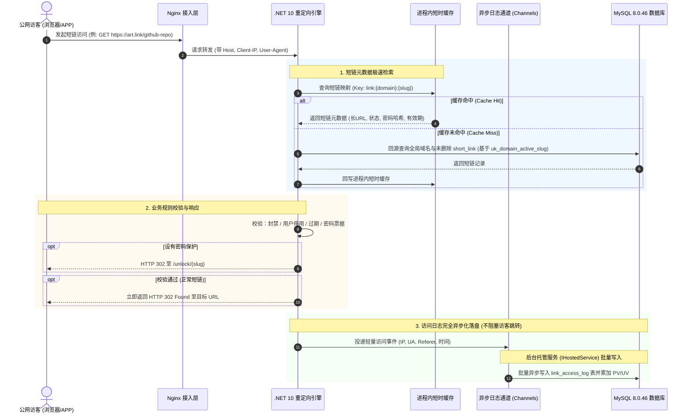

# 技术架构说明书 (Technical Architecture Specification)

本文档定义 **Arturia.ShortLink** 平台的端到端技术拓扑、底层高并发数据流、公网短链毫秒级 302 重定向机制与缓存防击穿架构。  
旨在为前端构建与后端 Agent 实施 .NET 10 + C# WebAPI + MySQL 8.0.46 提供全景技术架构蓝图与工程设计依据。

---

## 文档概述与修订记录

| 版本 | 修订日期 | 修订人 | 修订说明 |
| :--- | :--- | :--- | :--- |
| **v1.0.0** | 2026-09-06 | 系统架构团队 | 初始化端到端系统架构设计（总体拓扑、302 跳转时序、缓存防穿透/击穿策略与后端落地建议） |
| **v1.1.0** | 2026-09-14 | 后端 Agent (Codex) | 对齐后端 MVP：移除 Redis/RabbitMQ/Dapper 运行时依赖，采用 EF Core 9/Pomelo 9、进程内缓存与 Channels，更新域名绑定、软删除及 302 时序 |

---

## 1. 系统总体技术拓扑图

短链系统是典型的**“读多写少、读写比通常达 50:1 以上”**的高吞吐 Web 系统。系统在逻辑与物理层面划分为管理控制台端与公网极速跳转端：

```mermaid
flowchart TB
    subgraph Clients["客户端层 (Clients)"]
        A1["管理员/运营人员 (Web 控制台)"]
        A2["公网真实访客 (短链点击)"]
        A3["第三方集成系统 (OpenAPI / Token)"]
    end

    subgraph Gateway["接入与反向代理层 (Nginx)"]
        B1["Nginx 入口反代"]
        B2["静态前端托管 (React SPA)"]
        B3["SSL 卸载与公网证书自动化"]
    end

    subgraph Service["应用服务层 (.NET 10 WebAPI)"]
        C1["管理后台控制器 (Link / Workspace / Analytics)"]
        C2["公网极速重定向引擎 (Redirect Engine)"]
        C3["异步日志采集通道 (System.Threading.Channels)"]
        C4["可降级 GeoIP 解析 & 内置 UA 特征识别"]
    end

    subgraph Storage["MVP 数据与缓存基础设施层"]
        D1["进程内短时缓存与风险规则快照"]
        D2[("MySQL 8.0.46 主库")]
    end

    A1 -->|管理操作| B1 --> B2
    A3 -->|Bearer API Key| B1 --> C1
    A2 -->|GET /{slug}| B1 --> C2

    C1 --> D2
    C1 --> D1

    C2 -->|优先查缓存| D1
    C2 -.->|缓存未命中回源| D2
    C2 -->|即时响应 302 Found| A2
    C2 -->|非阻塞投递日志| C3
    C3 -->|削峰入库| D2
```

MVP 不引入 Redis、RabbitMQ 或 ClickHouse。它们仅作为第二期候选能力，必须在修订架构、清单和部署规范并获得人工批准后方可加入。

---

## 2. 核心链路设计与时序流转

### 2.1 高性能公网短链 302 重定向时序图

为确保公网短链跳转延迟控制在 10ms ~ 30ms 极速水准，**重定向动作与访问明细日志落盘必须完全异步解耦**：



### 2.2 分布式短码生成与冲突处理机制

短链的短码（Slug）在商用 SaaS 平台中确立以下生成与唯一性策略：

1. **域名级作用域唯一性**：
   * `link_domain` 全局唯一保存真实 Host，`workspace_domain` 负责租户绑定；系统域名可多租户共享，自定义域名仅可绑定一个租户。
   * `short_link.active_slug` 是仅在 `deleted_at IS NULL` 时有值的 `ascii_bin` 生成列，唯一索引为 `UNIQUE KEY uk_domain_active_slug (domain_id, active_slug)`。
   * 优势：不同租户各自绑定的独立二级域名（如 `link.brand-a.com` 与 `link.brand-b.com`）可复用非平台保留的高价值词汇（如 `/sale`、`/docs`、`/pricing`）；`/api`、`/login`、`/unlock` 与控制台/状态页一级路由始终保留。
2. **自动生成 6 位 Base62 算法**：
   * 字符池：`[0-9a-zA-Z]`（共 62 个字符），6 位长度包含 $62^6 \approx 568$ 亿种唯一组合。
   * 使用密码学安全随机数生成器从字符池生成固定 6 位 Base62；以数据库唯一索引作为最终并发裁决，冲突时执行带随机抖动的指数退避并重新生成，达到配置的最大尝试次数后返回可诊断冲突错误。不得使用会产生不足 6 位结果的未填充自增 ID 直转方案。
3. **自定义别名校验**：
   * 强制正则过滤：`^[a-zA-Z0-9_-]{3,32}$`，并比对保留路由黑名单（如 `api`, `login`, `admin`, `assets` 等）。

---

## 3. MVP 缓存策略与高并发防穿透设计

### 3.1 缓存键设计与 Cache-Aside 范式
* **进程内缓存 Key 命名规范**：`art:link:{domain}:{slug}`（存储目标 URL、短链 ID、封禁/启用状态、密码哈希、过期时间），设置短 TTL 与容量上限。
* **更新策略**：
  * 修改目标长链接、密码、有效期、启停/封禁状态或软删除短链时，执行 **“先更新数据库，再立即主动删除缓存（Cache Eviction）”**。

### 3.2 防缓存穿透 (Cache Penetration)
* **风险场景**：黑客或恶意扫描器大量请求不存在的短码（如 `/not-exist-1234`），导致请求直接全部穿透打崩 MySQL 数据库。
* **防护机制**：
  1. **空值短期缓存 (Cache Null Object)**：回源 MySQL 查无此码时，在进程内写入空占位值并设置极短过期时间（如 60 秒），防止重复穿透。
  2. **布隆过滤器 (Bloom Filter - 演进规划)**：在网关或应用启动层加载短码布隆过滤器，对明确不存在的短码直接在内存阶段秒级拒绝。

---

## 4. 后端 .NET 10 分层架构建议

为保证后端代码具备整洁边界、强类型约束与可测试性，采用标准 Clean Architecture：

```text
src/
├── Arturia.ShortLink.Domain/            # 【领域核心层】实体 (Entities)、领域事件、业务枚举
│   ├── Entities/                        # ShortLink, Workspace, Domain, User
│   └── Enums/                           # RoleTier, LinkStatus, DeviceType
├── Arturia.ShortLink.Application/       # 【应用服务层】业务逻辑用例、DTO、FluentValidation、映射
│   ├── Links/                           # CreateLinkCommand, GetLinksQuery
│   ├── Analytics/                       # GetAnalyticsSummaryQuery
│   └── Common/                          # Result<T>, ICurrentUserService
├── Arturia.ShortLink.Infrastructure/    # 【基础设施层】MySQL EF Core、进程内缓存、Channels日志
│   ├── Persistence/                     # AppDbContext, EntityConfigurations
│   ├── Cache/                           # 进程内短时缓存实现
│   └── Logging/                         # ChannelBackgroundLogConsumer (IHostedService)
└── Arturia.ShortLink.Api/               # 【展示接入层】ASP.NET Core 10 WebAPI 控制器与过滤器
    ├── Controllers/                     # LinksController, WorkspacesController, RedirectController
    ├── Middlewares/                     # ExceptionHandlingMiddleware, WorkspaceContextMiddleware
    └── Program.cs                       # 依赖注入与管道配置
```

> **持久化基线**：统一使用 **EF Core 9.0.20 + Pomelo 9.0.0** 配合强类型实体映射、迁移与编译查询；不得在 MVP 私自引入 Dapper。公网查询允许受控绕过租户过滤，但必须显式保留 `deleted_at IS NULL` 条件。
