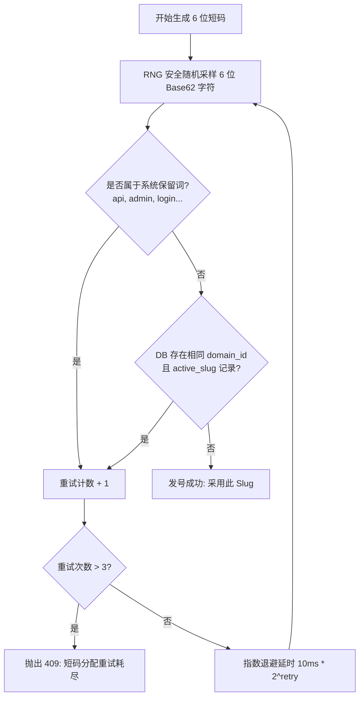
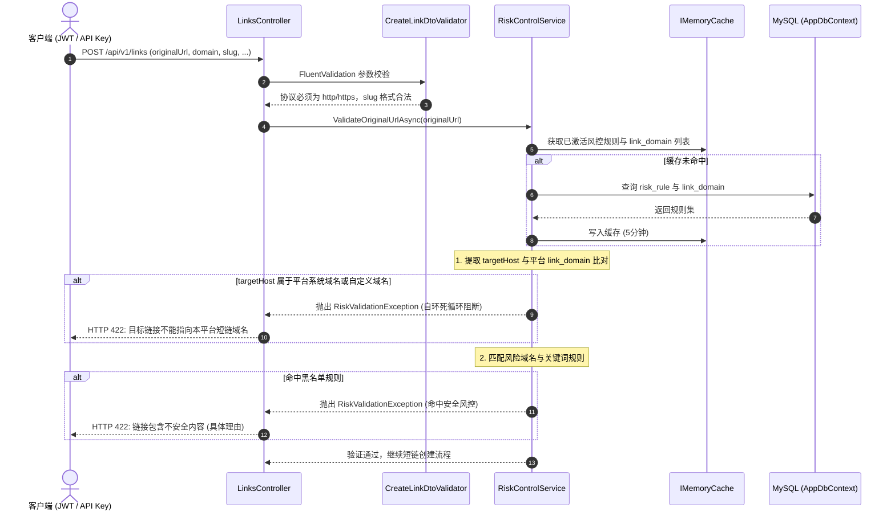
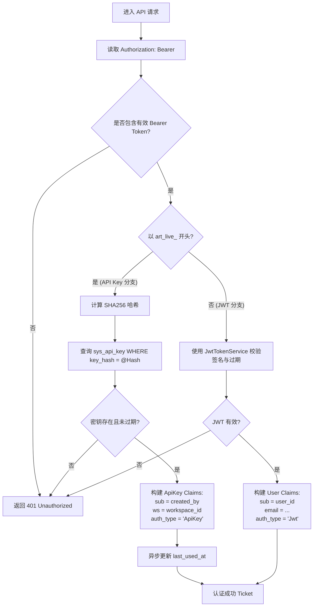
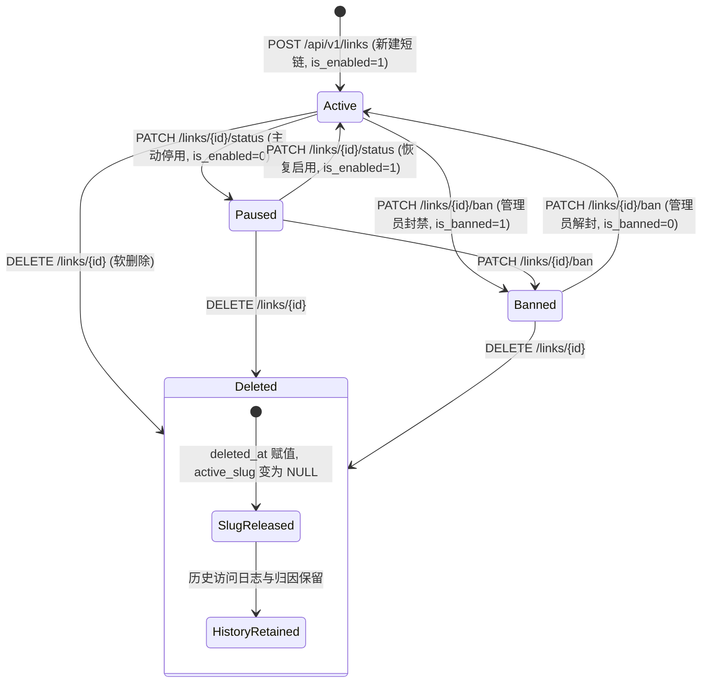

# Arturia.ShortLink - 后端阶段三详细设计说明书 (Phase 3: ShortLink Engine, Custom Aliases & API Keys)

本文档是 **Arturia.ShortLink** 平台后端阶段三的核心架构设计与工程实操蓝图，专为**专职后端 AI Agent** 编写。  
后端 Agent 在独立会话中承接本阶段时，以此文档作为唯一的技术与业务执行基准，遵循 Clean Architecture 四层分层、双模鉴权与 TDD 集成测试门禁，完成阶段三全部交付。

---

## 文档概述与修订记录

| 版本 | 修订日期 | 修订人 | 修订说明 |
| :--- | :--- | :--- | :--- |
| **v1.0.0** | 2026-09-16 | AI 代理 (Antigravity) | 基于 `/grill-me` 深度架构决议，输出后端阶段三端到端详细设计说明书（6位安全随机 Base62 发号与指数退避重试、平台自环检测与 IMemoryCache 风控规则加载、ASP.NET Core SlidingWindow 滑动窗口多维限流、双模 Bearer 鉴权与 API Key 凭据模型、短链生命周期/软删除 Slug 释放及 RBAC 细粒度控制） |

---

## 1. 阶段目标与交付范围 (Objectives & Scope)

### 1.1 阶段核心目标
构建商业化多租户短链系统的短链核心管理引擎与开放平台能力：
1. **短码发号与别名引擎**：实现 6 位安全随机 Base62 短码自动发号（容量约 568 亿）与指数退避重试（最多 3 次）；支持小写/大小写敏感自定义别名格式校验（`^[a-zA-Z0-9_-]{3,32}$`）与内置保留词阻断；提供别名可用性检查接口；
2. **短链全生命周期 CRUD**：实现短链分页查询（模糊搜索、域名/状态过滤、关联创建者信息）、创建（自动提取 5 项 UTM 参数持久化、密码哈希存储）、更新、快速启停翻转、软删除（释放 Slug）及管理员封禁；
3. **细粒度 RBAC 权限控制**：空间 `owner` 与 `admin` 可管理空间内所有短链；`member` 仅可更新、启停、删除本人创建的短链，越权调用严格返回 `403 Forbidden`；
4. **安全风控与自环防御**：协议强制 `http/https` 白名单；提取长链接 Host 对比全平台已注册域名（`link_domain`）拦截所有平台自环嵌套；基于 `IMemoryCache` 缓存风控规则（`risk_rule`），确保极速匹配与零额外 DB 损耗；
5. **多维请求速率限制 (Rate Limiting)**：基于 ASP.NET Core 原生 `System.Threading.RateLimiting` 实现滑动窗口（SlidingWindow）限流；登录/解锁按 IP 限流（10 次/分），短链创建按认证主体（User/ApiKey）限流（30 次/分），超限统一返回真实 HTTP 429 与标准 `ApiResponse<null>`；
6. **双模 Bearer 鉴权与 API Key 开放接口**：实现自定义鉴权处理器，透明支持用户 JWT 与开放平台 API Key（`art_live_...`）；API Key 采用 SHA256 哈希存储并仅在创建时返回一次明文；实施固定受限策略（Link-Only），仅开放短链 CRUD 与别名检查，严禁操作成员、工作空间、域名及 API Key 本身；创建短链时审计归属固化为 API Key 创建者。

### 1.2 本阶段明确排除范围 (Out of Scope for Phase 3)
* 公网极速 302 重定向路由与 `System.Threading.Channels` 高并发日志消费落盘（阶段四交付）；
* 密码保护短链访问重定向至 SPA `/unlock/{slug}` 及放行 Cookie 票据下发接口 `POST /api/v1/links/{slug}/unlock`（阶段四交付；阶段三仅负责在短链表保存 BCrypt 密码哈希并在 DTO 中返回 `hasPassword: true/false`）；
* 数据分析看板维度聚合统计接口（阶段五交付）；
* 自定义域名 CNAME DNS 探测与主域名切换接口（阶段五交付；阶段三仅校验短链引用的域名必须为当前空间绑定的有效域名）；
* 短链批量导入与导出功能（超出既定 MVP 范围，留待后续迭代）。

---

## 2. 核心架构设计与业务时序 (Architecture & Workflows)

### 2.1 6 位 Base62 短码发号与冲突探测算法

#### 2.1.1 算法设计原理
短码发号采用**密码学安全伪随机字符池采样**，结合 MySQL `(domain_id, active_slug)` 唯一索引进行域内冲突检测：
* **字符集**：`0123456789abcdefghijklmnopqrstuvwxyzABCDEFGHIJKLMNOPQRSTUVWXYZ`（62 个字符，Base62）；
* **短码长度**：固定 6 位，理论组合空间为 $62^6 = 56,800,235,584$（约 568 亿）；
* **随机发生器**：使用 `System.Security.Cryptography.RandomNumberGenerator.GetBytes()`，彻底避免时间戳与自增 ID 导致的短码可预测性与遍历爬取；
* **冲突退避策略**：
  1. 生成 6 位随机短码候选值；
  2. 查询当前工作空间指定域名下是否存在未删除的活跃 Slug：
     ```sql
     SELECT 1 FROM short_link WHERE domain_id = @DomainId AND active_slug = @Slug LIMIT 1;
     ```
  3. 若无冲突，直接采用该短码；
  4. 若发生冲突，进入重试循环（最大重试次数 = 3，每次重试以指数微延迟 `10ms * (2 ^ retry)` 退避重新随机）；
  5. 超过 3 次仍冲突（概率小于百亿分之一），抛出业务异常并返回 HTTP 409 Conflict。



---

### 2.2 自定义别名（Slug）校验与保留词黑名单

用户创建短链时可自定义别名（`slug`），更新短链时不修改 `slug`。别名规则如下：
1. **格式正则约束**：`^[a-zA-Z0-9_-]{3,32}$`（3 到 32 位字母、数字、短横线、下划线，大小写敏感）；
2. **系统硬编码保留词列表（Reserved Slugs）**：
   * 路由与管理端保留：`api`, `admin`, `login`, `register`, `dashboard`, `settings`, `analytics`, `domains`, `links`, `workspaces`, `members`, `invitations`, `apikeys`, `keys`;
   * 状态与跳转保留：`unlock`, `banned`, `suspended`, `expired`, `not-found`, `404`, `500`;
   * 基础设施保留：`health`, `live`, `ready`, `scalar`, `swagger`, `favicon`, `robots`, `sitemap`;
3. **数据库驱动风险保留词**：
   * 读取 `risk_rule` 中 `rule_type = RiskRuleType.ReservedSlug` 且 `is_active = 1` 的规则，合并至校验集合。
4. **别名检测接口 (`GET /api/v1/links/check-slug`)**：
   * 参数：`domain`（必填）、`slug`（必填）、`excludeId`（可选，短链 ID 字符串）；
   * 先走保留词黑名单与格式校验；未通过直接返回 `{ available: false, message: "该别名属于系统保留词或格式不合法" }`；
   * 若格式合法，查询当前空间绑定的该域名下，是否存在 `active_slug == slug` 且 `id != excludeId` 的记录；
   * 若存在返回 `{ available: false, message: "该别名已被占用" }`，否则返回 `{ available: true, message: "该别名可用" }`。

---

### 2.3 安全风控与平台自环检测引擎 (Risk Control)

#### 2.3.1 平台自环死循环防御 (Platform Self-Loop Prevention)
为防止用户将目标 URL 指向平台自身生成的短链地址导致重定向死循环或放大攻击：
1. 解析 `originalUrl`，提取其目标 Host（转为小写 ASCII/Punycode 并剥离端口）；
2. 获取当前系统内**所有已注册的域名列表**（从 `link_domain` 表中加载，包括所有系统域名与所有工作空间的自定义域名）；
3. **自环判定**：若目标 Host 命中上述任意域名，**一律拒绝创建或更新**，抛出风控异常，返回 **HTTP 422 Unprocessable Entity**：
   ```json
   {
     "code": 422,
     "success": false,
     "message": "目标链接不能指向本平台短链域名，以防止循环重定向",
     "data": null
   }
   ```

#### 2.3.2 协议白名单与敏感规则匹配
* **协议白名单**：仅允许 `http://` 与 `https://` 协议，其余如 `javascript:`, `data:`, `vbscript:`, `file:` 等恶意协议在 FluentValidation 阶段直接阻断（返回 HTTP 422）；
* **内存缓存风控规则（`IMemoryCache`）**：
  * 在 `Infrastructure` 层封装 `IRiskControlService`；
  * 将 `risk_rule` 表中全部激活状态的规则缓存至 `IMemoryCache`，默认滑动过期时间 5 分钟；
  * 提供 `InvalidateCache()` 方法，在管理端增删改风控规则时立即清除缓存；
  * 对 `originalUrl` 进行模式匹配：
    * `RiskRuleType.Scheme`：协议前缀检测；
    * `RiskRuleType.Domain`：域名黑名单检测（基于 `RiskMatchType.Exact` 或 `Suffix`）；
    * `RiskRuleType.Keyword`：危险路径或查询参数敏感词（基于 `RiskMatchType.Contains` 或 `Regex`）；
  * 若命中任何黑名单规则，返回 HTTP 422 及具体封禁理由。



---

### 2.4 ASP.NET Core 原生 SlidingWindow 限流策略

系统引入 `Microsoft.AspNetCore.RateLimiting`，基于 **滑动窗口（SlidingWindow）** 算法实施细粒度防刷保护，不引入外部 Redis 依赖：

#### 2.4.1 分区限流策略配置矩阵

| 限流策略名称 | 作用端点 | 分区键 (Partition Key) | 窗口时长 | 窗口段数 | 最大请求数 | 超限行为 |
| :--- | :--- | :--- | :--- | :--- | :--- | :--- |
| `auth-unlock-limiter` | 登录 (`/auth/login`)、注册 (`/auth/register`)、解锁 (`/links/{slug}/unlock`) | 客户端真实 IP (`RemoteIpAddress`) | 1 分钟 | 6 段 (每段10秒) | **10 次** | HTTP 429 |
| `link-create-limiter` | 创建短链 (`POST /api/v1/links`) | 认证主体标识 (`user:{userId}` 或 `apikey:{keyHash}`) | 1 分钟 | 6 段 (每段10秒) | **30 次** | HTTP 429 |
| `public-redirect-limiter` | 公网重定向 (`GET /{slug}`) | 客户端真实 IP (`RemoteIpAddress`) | 1 分钟 | 6 段 (每段10秒) | **120 次** | HTTP 429 |

#### 2.4.2 429 超限响应格式标准
配置 `OnRejected` 回调，统一拦截并输出契约标准的 JSON 错误体，同时附加 `Retry-After` 响应头：
```json
{
  "code": 429,
  "success": false,
  "message": "请求过于频繁，请稍后重试",
  "data": null
}
```

---

### 2.5 双模 Bearer 鉴权与 API Key 凭据模型

#### 2.5.1 API Key 数据规范与哈希安全
* **Key 明文生成格式**：`art_live_` 前缀 + 32 位加密随机字符（Base62 或十六进制），例如 `art_live_7x9aB3c4D5e6F7g8H9i0J1k2L3m4N5o6`；
* **存储安全标准**：
  * 服务端**严禁明文存储完整 API Key**；
  * 使用 SHA256 算法计算 Key 明文哈希，写入 `sys_api_key.key_hash`（配置 `uk_key_hash` 唯一索引）；
  * 仅提取前缀及随机串前 3 位存入 `sys_api_key.key_prefix`（如 `"art_live_7x9"`）供控制台辨认；
  * API Key 明文仅在 `POST /api/v1/api-keys` 接口创建成功的瞬间向客户端返回一次，之后不再可能找回。

#### 2.5.2 双模鉴权处理器 (`DualBearerAuthenticationHandler`) 架构
在 ASP.NET Core 认证管道中定制 Bearer Scheme 处理器，支持透明解包：



#### 2.5.3 固定受限策略（Link-Only Scope）与端点授权矩阵
API Key 仅能作为轻量级自动化与集成凭据，严格执行最小权限原则：

| 接口分类 | 典型路径 | JWT 凭据访问 | API Key 凭据访问 | 拦截与响应规则 |
| :--- | :--- | :---: | :---: | :--- |
| **短链核心** | `GET /api/v1/links`<br/>`POST /api/v1/links`<br/>`GET /api/v1/links/check-slug`<br/>`PUT /api/v1/links/{id}`<br/>`PATCH /api/v1/links/{id}/status`<br/>`DELETE /api/v1/links/{id}` | ✅ 允许 | ✅ **允许** | API Key 的 `X-Workspace-Id` 必须与该 Key 所属工作空间完全一致；创建短链时 `created_by` 强行绑定为该 Key 的创建者，禁止伪造。 |
| **工作空间与成员** | `/api/v1/workspaces/*` | ✅ 允许 | ❌ **禁止** | 返回 `403 Forbidden` (`API Key 无权访问空间配置`) |
| **域名管理** | `/api/v1/domains/*` | ✅ 允许 | ❌ **禁止** | 返回 `403 Forbidden` |
| **API Key 管理** | `/api/v1/api-keys/*` | ✅ 允许 | ❌ **禁止** | 返回 `403 Forbidden`（禁止 API Key 自行创建/删除 Key） |
| **管理员封禁** | `PATCH /api/v1/links/{id}/ban` | ✅ 仅限管理员 | ❌ **禁止** | 返回 `403 Forbidden` |

---

### 2.6 短链生命周期与软删除释放 Slug 状态机



* **活跃 Slug 唯一性**：数据库 `short_link` 表配置生成列 `active_slug = (case when (deleted_at is null) then slug else NULL end)` 及复合唯一索引 `uk_domain_active_slug (domain_id, active_slug)`；
* **软删除释放机制**：执行 `DELETE /api/v1/links/{id}` 时，写入 `deleted_at = DateTime.UtcNow` 与 `deleted_by = CurrentUser.Id`；MySQL 自动将 `active_slug` 置为 `NULL`，**同一域名下的相同 Slug 立即对新短链可用**；
* **RBAC 拦截**：
  * `owner` / `admin`：可更新、启停、软删除空间内的任意短链；
  * `member`：仅能更新、启停、软删除本人创建的短链（`link.CreatedBy == CurrentUser.Id`），否则抛出 `ForbiddenException` 返回 HTTP 403：`{ "code": 403, "success": false, "message": "无权限：业务协作者仅可操作本人创建的短链" }`。

---

## 3. 领域模型与接口契约详细映射 (Domain & DTO Mapping)

### 3.1 实体映射回顾 (`ShortLink` & `ApiKey`)
短链与 API Key 实体已在阶段一建立，阶段三主要通过业务逻辑将其完全激活：
* `ShortLink`：实现 `IWorkspaceScopedEntity`，受 EF Core `HasQueryFilter` 自动隔离；
* `ApiKey`：实现 `IWorkspaceScopedEntity`，记录 `KeyPrefix`、`KeyHash`、`LastUsedAt`、`ExpiresAt`。

---

### 3.2 短链管理接口契约 (Links API)

#### 3.2.1 分页查询短链列表
* **端点**：`GET /api/v1/links`
* **Query 参数**：
  * `page`: int（从 1 开始，默认 1）
  * `pageSize`: int（默认 50，最大 100）
  * `search`: string（可选，模糊匹配 slug / 标题 / 原始 URL）
  * `domain`: string（可选，域名 Host 精确过滤）
  * `isEnabled`: bool?（可选，启停过滤）
* **响应 `data`**：`PageResult<ShortLinkItemDto>`
  ```json
  {
    "items": [
      {
        "id": "1",
        "workspaceId": "1",
        "domain": "art.link",
        "slug": "dotnet10",
        "fullShortUrl": "https://art.link/dotnet10",
        "originalUrl": "https://dotnet.microsoft.com/download/dotnet/10.0?utm_source=twitter",
        "title": ".NET 10 正式版下载",
        "description": "最新运行时下载页面",
        "isEnabled": true,
        "isBanned": false,
        "hasPassword": true,
        "expiresAt": "2026-12-31T23:59:59Z",
        "pvCount": 1024,
        "uvCount": 650,
        "createdById": "1",
        "creatorName": "Arturia Admin",
        "creatorAvatar": "https://...",
        "createdAt": "2026-09-16T12:00:00Z"
      }
    ],
    "total": 1,
    "page": 1,
    "pageSize": 50,
    "totalPages": 1
  }
  ```
* **实现注意**：
  * 严禁输出 `passwordHash`；使用 `hasPassword = !string.IsNullOrEmpty(link.PasswordHash)`；
  * `fullShortUrl` 根据短链绑定的域名拼接 `https://{domain}/{slug}`；
  * 通过 Left Join `sys_user` 填充创建者姓名与头像（未找到时降级为 `"Unknown"` 与空字符串）。

#### 3.2.2 创建短链
* **端点**：`POST /api/v1/links`
* **限流策略**：`[EnableRateLimiting("link-create-limiter")]`
* **请求体 (`CreateLinkDto`)**：
  ```json
  {
    "originalUrl": "https://dotnet.microsoft.com/download/dotnet/10.0?utm_source=twitter&utm_medium=social",
    "domain": "art.link",
    "slug": "dotnet10",
    "title": ".NET 10 正式版下载",
    "description": "最新运行时下载页面",
    "password": "mypassword",
    "expiresAt": "2026-12-31T23:59:59Z"
  }
  ```
* **业务流转与校验规则**：
  1. 校验 `originalUrl`：合法 http/https 协议，非自环，未命中风控规则；
  2. 校验 `domain`：必须是当前工作空间在 `workspace_domain` 中已绑定的有效域名；
  3. 校验/分配 `slug`：
     * 若客户端未传或为空：调用 `IBase62Generator` 自动生成 6 位安全随机短码；
     * 若客户端显式指定：校验格式正则 `^[a-zA-Z0-9_-]{3,32}$`，校验非系统保留词，并在该域名下检测是否已被占用（已被占用返回 HTTP 409）；
  4. 解析 UTM 参数：从 `originalUrl` 查询参数中提取 `utm_source`, `utm_medium`, `utm_campaign`, `utm_term`, `utm_content` 填充至实体对应字段；
  5. 密码处理：若请求提供了非空 `password`，使用 BCrypt 计算哈希保存至 `PasswordHash`；
  6. 身份绑定：从当前上下文提取 `CurrentUser.Id` 赋给 `CreatedBy`（API Key 请求自动绑定为该 Key 的拥有者用户）；
  7. 插入数据库并返回创建成功的 `ShortLinkItemDto`（HTTP 201 Created）。

#### 3.2.3 检查短链别名可用性
* **端点**：`GET /api/v1/links/check-slug`
* **Query 参数**：`domain`（必填）、`slug`（必填）、`excludeId`（可选，短链 ID 字符串）
* **响应 `data`**：
  ```json
  {
    "available": true,
    "message": "该别名可用"
  }
  ```

#### 3.2.4 更新短链
* **端点**：`PUT /api/v1/links/{id}`
* **请求体 (`UpdateLinkDto`)**：
  ```json
  {
    "originalUrl": "https://dotnet.microsoft.com/download/dotnet/10.0",
    "title": ".NET 10 正式版下载 (已更新)",
    "description": "最新运行时更新下载页面",
    "hasPassword": true,
    "password": "new-password",
    "expiresAt": null
  }
  ```
* **规则与字段语义**：
  * RBAC：Member 仅限本人创建的短链，否则 403；
  * 不修改原短链的 `domain` 与 `slug`；
  * 密码控制：
    * `hasPassword == false`：清除密码（`PasswordHash = null`）；
    * `hasPassword == true` 且 `password` 非空：重新计算 BCrypt 哈希更新；
    * `hasPassword == true` 且 `password` 为空：保留原有密码哈希不变；
  * 重新执行自环与风控规则校验；重新解析 UTM 参数更新对应字段。

#### 3.2.5 快速启停状态翻转
* **端点**：`PATCH /api/v1/links/{id}/status`
* **规则**：无请求体；RBAC 校验（Member 仅限本人）；将 `IsEnabled = !IsEnabled`；返回更新后的 `ShortLinkItemDto`。

#### 3.2.6 软删除短链
* **端点**：`DELETE /api/v1/links/{id}`
* **规则**：RBAC 校验（Member 仅限本人）；写入 `DeletedAt = DateTime.UtcNow` 与 `DeletedBy = CurrentUser.Id`；返回 HTTP 200。

#### 3.2.7 管理员封禁/解封短链
* **端点**：`PATCH /api/v1/links/{id}/ban`
* **权限**：仅限 Owner/Admin 角色；API Key 调用一律 403；
* **请求体 (`BanLinkDto`)**：
  ```json
  {
    "isBanned": true,
    "reason": "违规传播恶意仿冒网站"
  }
  ```
* **规则**：
  * 若 `isBanned == true`：必须填写 `reason`，写入 `BannedAt = DateTime.UtcNow` 与 `BannedBy = CurrentUser.Id`；
  * 若 `isBanned == false`：清除 `BannedReason`、`BannedAt`、`BannedBy`。

---

### 3.3 开放平台 API Key 管理接口契约 (ApiKeys API)

本模块所有端点**仅接受 JWT 认证**且调用者角色必须为 `owner` 或 `admin`；API Key 凭据访问直接返回 `403 Forbidden`。

#### 3.3.1 获取密钥列表
* **端点**：`GET /api/v1/api-keys`
* **响应 `data`**：
  ```json
  [
    {
      "id": "1",
      "name": "CI/CD 自动化构建集成",
      "keyPrefix": "art_live_7x9",
      "createdAt": "2026-09-01T12:00:00Z",
      "lastUsedAt": "2026-09-05T09:30:00Z",
      "expiresAt": null
    }
  ]
  ```

#### 3.3.2 创建新 API Key
* **端点**：`POST /api/v1/api-keys`
* **请求体 (`CreateApiKeyDto`)**：
  ```json
  {
    "name": "生产环境短链同步密钥",
    "expiresAt": null
  }
  ```
* **业务流转**：
  1. 生成 32 位安全随机字符串，拼接得到完整明文 Key：`art_live_{random32}`；
  2. 截取前缀 `art_live_{random前3位}` 作为 `KeyPrefix`；
  3. 计算 SHA256 哈希作为 `KeyHash`；
  4. 插入 `sys_api_key`，记录 `WorkspaceId` 与 `CreatedBy = CurrentUser.Id`；
  5. 响应 `data`（仅在创建成功时返回一次完整明文 `apiKey`）：
     ```json
     {
       "id": "2",
       "name": "生产环境短链同步密钥",
       "keyPrefix": "art_live_a1b",
       "apiKey": "art_live_a1b2c3d4e5f6g7h8i9j0k1l2m3n4o5p6",
       "createdAt": "2026-09-16T15:00:00Z",
       "expiresAt": null
     }
     ```

#### 3.3.3 撤销/删除 API Key
* **端点**：`DELETE /api/v1/api-keys/{id}`
* **业务流转**：从数据库中物理删除对应 `sys_api_key` 记录；返回 HTTP 200。

---

## 4. 核心工程实现蓝图 (Implementation Blueprint)

遵循 Clean Architecture 四层分工，工程代码组织如下：

```text
backend/src/
├── Arturia.ShortLink.Domain/
│   └── (利用已有 ShortLink, ApiKey, RiskRule 实体与枚举)
│
├── Arturia.ShortLink.Application/
│   ├── Links/
│   │   ├── Commands/
│   │   │   ├── CreateLinkCommand.cs
│   │   │   ├── UpdateLinkCommand.cs
│   │   │   ├── ToggleLinkStatusCommand.cs
│   │   │   ├── DeleteLinkCommand.cs
│   │   │   └── BanLinkCommand.cs
│   │   ├── Queries/
│   │   │   ├── GetLinksPagedQuery.cs
│   │   │   └── CheckSlugQuery.cs
│   │   ├── DTOs/
│   │   │   ├── ShortLinkItemDto.cs
│   │   │   ├── CreateLinkDto.cs
│   │   │   ├── UpdateLinkDto.cs
│   │   │   ├── CheckSlugResultDto.cs
│   │   │   └── BanLinkDto.cs
│   │   ├── Validators/
│   │   │   ├── CreateLinkDtoValidator.cs
│   │   │   └── UpdateLinkDtoValidator.cs
│   │   ├── Services/
│   │   │   ├── IBase62Generator.cs
│   │   │   ├── IRiskControlService.cs
│   │   │   └── ILinkService.cs
│   │   └── LinkService.cs
│   │
│   └── ApiKeys/
│       ├── Commands/
│       │   ├── CreateApiKeyCommand.cs
│       │   └── DeleteApiKeyCommand.cs
│       ├── Queries/
│       │   └── GetApiKeysQuery.cs
│       ├── DTOs/
│       │   ├── ApiKeyItemDto.cs
│       │   ├── CreateApiKeyDto.cs
│       │   └── ApiKeyCreatedResultDto.cs
│       ├── Validators/
│       │   └── CreateApiKeyDtoValidator.cs
│       ├── Services/
│       │   └── IApiKeyService.cs
│       └── ApiKeyService.cs
│
├── Arturia.ShortLink.Infrastructure/
│   ├── Authentication/
│   │   └── DualBearerAuthenticationHandler.cs     # 双模 Bearer (JWT + API Key) 鉴权处理器
│   └── Services/
│       ├── Base62Generator.cs                     # 6位安全随机 Base62 生成器
│       └── RiskControlService.cs                  # IMemoryCache 驱动的风控与自环拦截器
│
└── Arturia.ShortLink.Api/
    ├── Controllers/
    │   ├── LinksController.cs                     # 短链 CRUD、启停、别名检测与封禁
    │   └── ApiKeysController.cs                   # 开放密钥管理
    └── Extensions/
        └── RateLimiterExtensions.cs               # SlidingWindow 限流策略注册与 429 拦截器
```

---

## 5. 质量保证与集成测试矩阵 (Integration Tests Plan)

在 `Arturia.ShortLink.IntegrationTests` 中新增针对阶段三的完整端到端测试，基于真实 MySQL 8.0.46 容器运行，覆盖以下关键场景：

### 5.1 短码发号与别名检测测试 (`LinksSlugTests.cs`)
1. **自动发号测试**：不传 `slug` 创建短链，断言返回长度为 6 的合法 Base62 短码；
2. **冲突退避测试**：模拟同域名同 Slug 存在，验证自动重试并发号成功；
3. **别名格式测试**：输入小于 3 位或大于 32 位、含有非法字符的别名，断言返回 HTTP 400/422；
4. **保留词拦截测试**：以 `api`、`admin`、`login` 作为别名创建短链，断言返回 HTTP 422 业务异常；
5. **CheckSlug 接口测试**：验证已被占用的别名返回 `available: false`，软删除后的别名返回 `available: true`，带有 `excludeId` 自身时返回 `available: true`。

### 5.2 短链 CRUD 与 RBAC 权限测试 (`LinksCrudTests.cs`)
1. **创建短链测试**：验证 UTM 参数自动解析落盘；验证密码哈希计算存储，返回 `hasPassword: true` 但绝不返回密码哈希；
2. **分页与过滤测试**：按搜索词模糊查询、按 `domain` 过滤、按 `isEnabled` 过滤；验证创建者信息正常关联；
3. **Member 细粒度权限测试**：
   * Member A 修改本人短链，成功；
   * Member A 修改 Member B 的短链，断言严格返回 **HTTP 403**；
   * Member A 启停/删除 Member B 的短链，断言严格返回 **HTTP 403**；
4. **Admin/Owner 权限测试**：Admin 修改 Member 用户的短链，成功；
5. **软删除释放 Slug 测试**：删除短链后，再次使用同一域名与相同 Slug 创建新短链，断言成功无冲突。

### 5.3 安全风控与自环防御测试 (`RiskControlTests.cs`)
1. **平台自环拦截测试**：
   * 将 `originalUrl` 设置为系统域名短链 `https://art.link/test123`，断言返回 **HTTP 422**；
   * 将 `originalUrl` 设置为自定义域名短链 `https://go.arturia.dev/demo`，断言返回 **HTTP 422**；
2. **协议白名单测试**：输入 `javascript:alert(1)` 或 `data:text/html,...`，断言返回 **HTTP 400/422**；
3. **风控规则拦截测试**：输入命中 `risk_rule` 敏感词的 URL，断言返回 **HTTP 422** 并提示封禁原因。

### 5.4 请求限流测试 (`RateLimitingTests.cs`)
1. **短链创建限流测试**：同一身份在 1 分钟内并发请求 35 次，前 30 次成功，后 5 次严格返回 **HTTP 429** 且响应包含标准 `ApiResponse` 结构；
2. **登录限流测试**：同一 IP 在 1 分钟内连续请求登录接口 12 次，第 11 次及之后返回 **HTTP 429**。

### 5.5 双模鉴权与 API Key 测试 (`ApiKeyAuthTests.cs`)
1. **API Key 创建与明文返回测试**：创建 API Key，验证响应包含一次性明文 `art_live_...`，数据库仅保存前缀与 SHA256 哈希；
2. **API Key 认证调用短链测试**：使用 `Authorization: Bearer art_live_...` 免登成功调用 `POST /api/v1/links` 创建短链，验证短链的 `created_by` 为该 Key 的拥有者用户 ID；
3. **API Key 越权拦截测试**：使用 API Key 调用 `GET /api/v1/workspaces/{id}/members`、`POST /api/v1/api-keys`、`PATCH /api/v1/links/{id}/ban`，断言一律返回 **HTTP 403**；
4. **API Key 撤销测试**：删除 API Key 后，再次使用该 Key 发起请求，断言返回 **HTTP 401 Unauthorized**。

---

## 6. 阶段验收与交付门禁 (Acceptance Criteria)

后端阶段三开发完成后，必须满足以下门禁方可请求人工验收：
1. **编译与代码规范**：`dotnet build backend/Arturia.ShortLink.sln -c Release` 确保 **0 警告、0 错误**；`dotnet format --verify-no-changes` 确保 100% 格式对齐；
2. **测试全覆盖**：所有既有 52 项测试及阶段三新增测试 **100% 通过**，0 失败、0 跳过；
3. **Scalar 交互式审阅**：启动 Kestrel 服务并打开 `http://localhost:5000/scalar/v1`，展示短链 CRUD、别名检测与 API Key 接口；
4. **人机协同合入闭环**：获得用户明确批准后，方可在特性分支勾选阶段三清单、同步刷新 `AGENTS.md` 文首的当前进度，执行 Conventional Commit、推送分支、发起 PR、Squash 合并并切回 main 同步。

---

## 7. 附录：后端开发 Agent 执行 Prompt 模板

> 本附录供人类开发者直接复制并发送给专职【后端开发 Agent】（在独立会话中运行）。开发 Agent 必须严格遵照以下指引开工：

```markdown
你好，你作为 Arturia.ShortLink 项目的专职【后端开发 Agent】，现在请启动【后端阶段三：短链核心映射、自定义别名与 API Key 开放接口】的代码落地。

【第一阶段：前置研读与架构理解（必读，理解后方可动工）】：
1. 宏观架构与基线文档：
   - `docs/后端详细设计与技术实现说明书.md`（Clean Architecture 四层规范、全局查询过滤器、数据库实体与命名约定）；
   - `docs/后端功能开发清单.md`（阶段三 3.1 ~ 3.5 验收清单与阶段范围）；
   - `docs/接口契约规范.md`（第 5 节短链管理与第 7 节 API Key 契约，注意若开发中涉及契约微调，允许随本阶段分支一同提交）。
2. 本阶段实施方案（核心蓝图）：
   - `docs/阶段详细设计/后端阶段三详细设计说明书.md`（请完整研读全部章节：6位Base62安全随机发号与退避算法、平台自环检测与IMemoryCache缓存风控、ASP.NET Core SlidingWindow 限流策略、DualBearerAuthenticationHandler 双模鉴权、API Key 固定受限策略、软删除释放 active_slug、RBAC 矩阵及集成测试矩阵）。

【第二阶段：切出特性分支并承载阶段资产】：
1. 确认当前处于 `main` 主干最新状态；
2. 切出特性分支（本阶段设计说明书已在本地就绪，将自动随分支带入）：
   `git checkout -b feat/phase-3-shortlink-engine-api-keys`
3. 确认 `git status`，确保工作区纯净或仅包含本阶段专属资产。

【第三阶段：编码实施核心重点】：
1. 6位安全随机 Base62 短码自动发号（RandomNumberGenerator）与指数退避重试（最多3次）；
2. 自定义别名正则（`^[a-zA-Z0-9_-]{3,32}$`）与保留词黑名单（api, admin 等系统路由及 risk_rule 中的保留词）；
3. 平台自环死循环防御（提取目标 Host 校验全平台 link_domain）与 IMemoryCache 风控规则加载；
4. ASP.NET Core 原生 SlidingWindow 限流策略与 429 统一 ApiResponse 拦截器；
5. DualBearerAuthenticationHandler 双模 Bearer 鉴权（透明支持 JWT 与 art_live_ API Key）；
6. API Key 固定受限策略（Link-Only），严禁访问成员/工作空间/域名/Key管理及管理员封禁端点；
7. 短链 CRUD、启停翻转、软删除释放 active_slug、管理员封禁及创建者关联；
8. Member 角色细粒度 RBAC 拦截（仅限本人短链，越权严格返回 HTTP 403）。

【第四阶段：质量门禁与人工审阅】：
1. 编写完整的 IntegrationTests（覆盖发号退避、CRUD/RBAC、自环风控、SlidingWindow 限流与双模 API Key）；
2. 确保既有 52 项及新增测试 100% Pass，`dotnet build backend/Arturia.ShortLink.sln -c Release` 确保 0 警告 0 错误，`dotnet format --verify-no-changes` 通过；
3. 启动 API 后使用 `Start-Process "http://localhost:5000/scalar/v1"` 唤起浏览器，向我汇报完成成果，等待我确认；
4. 在我明确批准前，严禁执行 git commit 或 git push。

【第五阶段：验收后合并闭环】：
1. 在我确认批准后，在 `docs/后端功能开发清单.md` 中勾选 Phase 3 任务项、同步刷新 `AGENTS.md` 文首的当前进度，并复跑全部门禁；
2. 将设计说明书、后端源码、测试、清单更新及本阶段契约微调一并提交并推送到远端特性分支；
3. 发起 PR 并使用 squash 合并入 main，切回 main 拉取最新代码后原地暂停。
```
