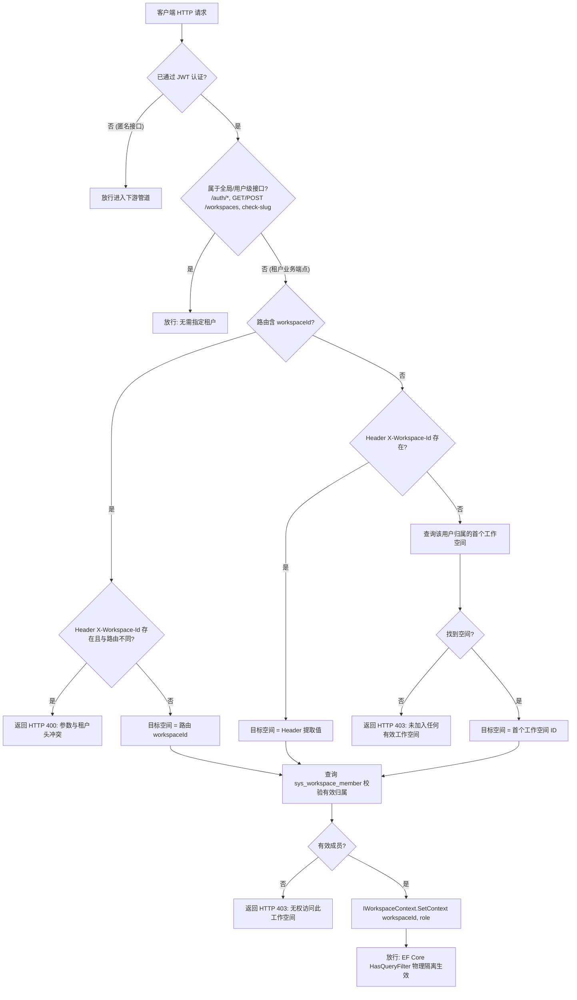
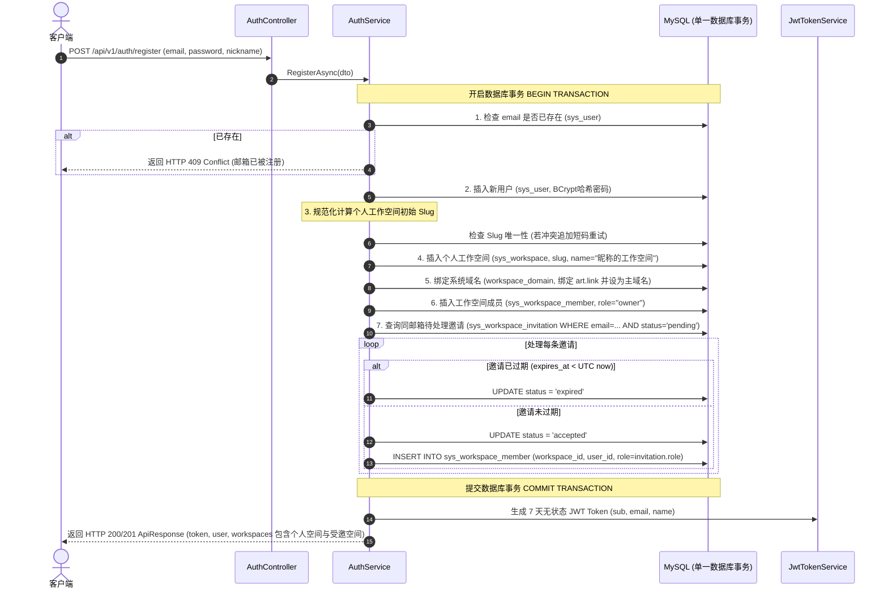

# Arturia.ShortLink - 后端阶段二详细设计说明书 (Phase 2: Auth, Multi-Tenancy & Workspace RBAC)

本文档是 **Arturia.ShortLink** 平台后端阶段二的核心架构设计与工程实操蓝图，专为**专职后端 AI Agent** 编写。  
后端 Agent 在独立会话中承接本阶段时，以此文档作为唯一的技术与业务执行基准，遵循 Clean Architecture 四层分层与 TDD 集成测试门禁，完成阶段二全部交付。

---

## 文档概述与修订记录

| 版本 | 修订日期 | 修订人 | 修订说明 |
| :--- | :--- | :--- | :--- |
| **v1.0.0** | 2026-09-15 | AI 代理 (Antigravity) | 基于 `/grill-me` 深度架构决议，输出后端阶段二端到端详细设计说明书（纯用户无状态 JWT、WorkspaceMiddleware 多租户解析与路由强校验、新用户注册双重并存初始化事务流转、个人空间 Slug 规范化生成算法、RBAC 细粒度权限矩阵与 Testcontainers 集成测试清单） |

---

## 1. 阶段目标与交付范围 (Objectives & Scope)

### 1.1 阶段核心目标
构建商业化多租户短链系统的认证与租户核心底座：
1. **统一用户认证**：提供基于 JWT + BCrypt 的邮箱密码注册、登录与个人信息获取；
2. **多租户动态解析与隔离**：编写 `WorkspaceMiddleware`，动态从请求头与路由提取并校验工作空间上下文，与 EF Core 全局查询过滤器无缝联动；
3. **双重并存注册流转**：实现新用户注册时强制初始化个人工作空间（Owner）与原子消费全部有效团队邀请（Member/Admin）的同一数据库事务闭环；
4. **工作空间与团队 RBAC 管理**：实现工作空间创建、Slug 可用性检查、成员列表、邀请（注册/未注册分支流转）、角色变更与成员移除。

### 1.2 本阶段明确排除范围 (Out of Scope for Phase 2)
* 开放平台 API Key 鉴权与短链 CRUD（阶段三交付）；
* 公网极速 302 重定向与 Channels 日志落盘（阶段四交付）；
* 外部真实 SMTP 发信服务（MVP 邀请流转基于数据库状态机，同邮箱注册后自动消费，无需发邮件）。

---

## 2. 核心架构设计与业务时序 (Architecture & Workflows)

### 2.1 纯用户无状态 JWT 凭据模型
* **设计原则**：JWT Token 保持**纯用户身份无状态**，严禁在 Token Payload 中固化 `workspace_id` 与 `role`。
* **Payload 声明 (Claims)**：
  * `ClaimTypes.NameIdentifier` (`sub`): 用户 ID（十进制字符串，如 `"1"`）
  * `ClaimTypes.Email` (`email`): 用户登录邮箱
  * `ClaimTypes.Name` (`name`): 用户昵称
  * `jti`: 唯一 Token 追踪 GUID
* **配置参数**：
  * 密钥（SecretKey）：必须至少 256 位（32 字节）；
  * 算法：HMAC-SHA256 (`HmacSha256`)；
  * 有效期：固定 7 天；无单独 Refresh Token 复杂度。
* **优势**：
  * 用户在控制台切换工作空间时，前端直接变更 HTTP 请求头 `X-Workspace-Id`，**完全无需请求后端换发 JWT**；
  * 用户在空间内的角色或成员关系变更（如被降权或移出空间）即时生效，无 Token 缓存滞后安全风险。

---

### 2.2 多租户解析中间件 (`WorkspaceMiddleware`) 流转时序



---

### 2.3 新用户注册“双重并存初始化”事务时序

新用户注册（`POST /api/v1/auth/register`）必须在**单个 MySQL 数据库事务（`IDbContextTransaction`）**中完成以下全部操作：



---

### 2.4 个人工作空间 Slug 自动生成与防重算法

为兼顾可读性、避免中文等非法字符并满足全局唯一索引 `uk_slug`：
* **目标正则规则**：严格符合 `^[a-z0-9](?:[a-z0-9-]{1,30}[a-z0-9])?$`（长度 3～32 位，小写英文字母、数字和中间短横线，首尾不可为短横线）。
* **算法流转**：
  1. 提取邮箱 `@` 前缀并转小写：例如 `Zhang-San_88@example.com` 提取得到 `zhang-san_88`；
  2. 过滤清洗：使用正则 `[^a-z0-9]` 替换为短横线 `-`，合并连续短横线，并去除首尾短横线；
  3. 保底长度校验：清洗后若字符数不足 3 位（如中文邮箱名导致清洗为空，或前缀为 `a`），统一前缀保底为 `"user"`；
  4. 截断预留：若前缀长度超过 20 位，截断至前 20 位；
  5. 拼装随机短码：在末尾拼接 `"-"` + 4 位随机 Base62/字母数字字符（如 `user-a7x9`，总长度不超过 25 位）；
  6. 唯一性防重：查询 `sys_workspace` 检查是否已存在该 Slug；若冲突则重新生成 4 位随机短码（最多重试 5 次），确保 100% 唯一入库。

---

### 2.5 工作空间与团队成员 RBAC 权限矩阵

工作空间成员操作（`/api/v1/workspaces/{workspaceId}/members/*`）必须严格执行以下权限矩阵与防自伤约束：

| 操作 | 目标端点 | Owner 权限 | Admin 权限 | Member 权限 | 核心硬性约束与边界 |
| :--- | :--- | :---: | :---: | :---: | :--- |
| **查询成员列表** | `GET .../members` | 允许 | 允许 | 允许 | 任意有效成员均可查看本空间成员与待处理邀请 |
| **邀请/添加成员** | `POST .../members` | 允许 | 允许 (仅限 invite member) | 禁止 (403) | Admin 只能邀请 Member，不可邀请 Admin；无法直接创建 Owner |
| **修改成员角色** | `PUT .../members/{id}` | 允许 (admin/member) | 禁止 (403) 或限 Member 升降 | 禁止 (403) | **严禁修改 Owner 角色（防自降级与越权）**；MVP 阶段角色调整仅限 Owner 操作 |
| **移除成员** | `DELETE .../members/{id}` | 允许 (除自己外) | 允许 (仅限移除 Member) | 禁止 (403) | **Owner 严禁被移除或自删（防孤儿空间）**；Admin 严禁移除 Owner 或其他 Admin |

* **参数一致性与防越权**：
  * URL 中的 `{workspaceId}` 必须与当前操作人有成员关系，否则统一返回 HTTP 403 Forbidden；
  * `{memberId}` 为 `sys_workspace_member.id`（十进制字符串），修改或删除时必须确保其所属 `workspace_id == {workspaceId}`，禁止跨空间越权篡改。

---

## 3. 各工程分层代码落地指导 (Layer-by-Layer Implementation)

遵循 Clean Architecture 四层依赖倒置原则（Api -> Infrastructure -> Application -> Domain）。

```text
backend/src/
├── Arturia.ShortLink.Domain/
│   ├── Common/
│   │   └── DomainExceptions.cs           # BusinessException, ForbiddenException, ConflictException 等
│   └── Interfaces/
│       ├── ICurrentUserService.cs        # 获取当前登录 UserId, Email
│       └── IWorkspaceContext.cs          # 注入和获取当前请求租户 WorkspaceId, Role
│
├── Arturia.ShortLink.Application/
│   ├── Auth/
│   │   ├── Dtos/AuthDtos.cs              # LoginRequest, RegisterRequest, AuthResponseDto, UserDto
│   │   ├── Interfaces/IAuthService.cs    # 登录、注册、Me 接口定义
│   │   ├── Interfaces/IPasswordHasher.cs # 密码哈希抽象
│   │   ├── Interfaces/IJwtTokenService.cs# JWT 签发抽象
│   │   └── Validators/AuthValidators.cs  # FluentValidation 校验器
│   └── Workspaces/
│       ├── Dtos/WorkspaceDtos.cs         # WorkspaceDto, CreateWorkspaceDto, TeamMemberDto, InviteDto
│       ├── Interfaces/IWorkspaceService.cs
│       ├── Interfaces/IWorkspaceMemberService.cs
│       └── Validators/WorkspaceValidators.cs
│
├── Arturia.ShortLink.Infrastructure/
│   ├── Security/
│   │   ├── BCryptPasswordHasher.cs       # BCrypt.Net-Next (WorkFactor=11)
│   │   └── JwtTokenService.cs            # System.IdentityModel.Tokens.Jwt
│   ├── Context/
│   │   └── WorkspaceContext.cs           # Scoped 租户上下文实现
│   └── Services/
│       ├── AuthService.cs                # 认证业务实现 (含双重并存初始化与邀请消费事务)
│       ├── WorkspaceService.cs           # 工作空间管理与 Slug 发号防重
│       └── WorkspaceMemberService.cs     # 成员与邀请业务流转及 RBAC 矩阵
│
└── Arturia.ShortLink.Api/
    ├── Controllers/
    │   ├── AuthController.cs             # /api/v1/auth/*
    │   ├── WorkspacesController.cs       # /api/v1/workspaces/*
    │   └── WorkspaceMembersController.cs # /api/v1/workspaces/{workspaceId}/members/*
    └── Middleware/
        └── WorkspaceMiddleware.cs        # 多租户动态提取、白名单过滤与隔离校验
```

---

### 3.1 `Domain` 层设计

#### 1. 业务异常体系 (`DomainExceptions.cs`)
在领域层定义通用异常，供应用层与基础设施层抛出，由 API 层的 `GlobalExceptionMiddleware` 捕获并映射为标准 HTTP 状态码：
```csharp
namespace Arturia.ShortLink.Domain.Common;

public class BusinessException(string message, int statusCode = 400) : Exception(message)
{
    public int StatusCode { get; } = statusCode;
}

public class UnauthorizedException(string message = "未授权访问") 
    : BusinessException(message, 401);

public class ForbiddenException(string message = "无权进行此操作") 
    : BusinessException(message, 403);

public class NotFoundException(string message = "所请求的资源不存在") 
    : BusinessException(message, 404);

public class ConflictException(string message = "资源冲突或已存在") 
    : BusinessException(message, 409);
```

---

### 3.2 `Application` 层设计

#### 1. DTO 契约 (`AuthDtos.cs` & `WorkspaceDtos.cs`)
```csharp
namespace Arturia.ShortLink.Application.Auth.Dtos;

public record LoginRequest(string Email, string Password);

public record RegisterRequest(string Email, string Password, string Nickname);

public record UserDto(string Id, string Email, string Nickname, string? AvatarUrl);

public record WorkspaceDto(string Id, string Name, string Slug, string Role);

public record AuthResponseDto(string Token, UserDto User, List<WorkspaceDto> Workspaces);

public record AuthMeResponseDto(UserDto User, List<WorkspaceDto> Workspaces);
```

```csharp
namespace Arturia.ShortLink.Application.Workspaces.Dtos;

public record CreateWorkspaceDto(string Name, string Slug);

public record CheckSlugResultDto(bool Available, string Message);

public record TeamMemberDto(
    string Id,
    string UserId,
    string Email,
    string Nickname,
    string? AvatarUrl,
    string Role,
    string Status, // "active" | "pending"
    DateTime JoinedAt
);

public record InviteMemberRequest(string Email, string Role);

public record UpdateMemberRoleRequest(string Role);
```

#### 2. FluentValidation 校验器
* `RegisterRequestValidator`:
  * `Email`: 非空、必须是合法邮箱格式、最大 128 字符；
  * `Password`: 非空、长度 8～64 位、必须包含大小写字母与数字；
  * `Nickname`: 非空、长度 1～32 字符。
* `CreateWorkspaceDtoValidator`:
  * `Name`: 非空、长度 2～32 字符；
  * `Slug`: 严格匹配正则 `^[a-z0-9](?:[a-z0-9-]{1,30}[a-z0-9])?$`。
* `InviteMemberRequestValidator`:
  * `Email`: 非空、合法邮箱格式；
  * `Role`: 只能是 `"admin"` 或 `"member"`（严禁传入 `"owner"`）。

---

### 3.3 `Infrastructure` 层设计

#### 1. 密码散列实现 (`BCryptPasswordHasher.cs`)
使用已锁定的依赖 `BCrypt.Net-Next`：
```csharp
public class BCryptPasswordHasher : IPasswordHasher
{
    private const int WorkFactor = 11;

    public string HashPassword(string password) =>
        BCrypt.Net.BCrypt.EnhancedHashPassword(password, WorkFactor);

    public bool VerifyPassword(string password, string passwordHash) =>
        BCrypt.Net.BCrypt.EnhancedVerify(password, passwordHash);
}
```

#### 2. 租户上下文实现 (`WorkspaceContext.cs`)
```csharp
public class WorkspaceContext : IWorkspaceContext
{
    public ulong? CurrentWorkspaceId { get; private set; }
    public string? CurrentRole { get; private set; }

    public void SetContext(ulong workspaceId, string role)
    {
        CurrentWorkspaceId = workspaceId;
        CurrentRole = role;
    }
}
```

#### 3. 邀请流转与重复邀请更新
在 `WorkspaceMemberService.InviteMemberAsync` 中：
* 检查当前租户是否已存在该邮箱的成员：若已是成员，抛出 `ConflictException("该用户已是工作空间成员")`；
* 检查当前租户是否已有待处理邀请：
  * 若存在且 `ExpiresAt > DateTime.UtcNow`：抛出 `ConflictException("该邮箱已有待处理的团队邀请，请勿重复邀请")`；
  * 若存在但 `ExpiresAt <= DateTime.UtcNow`：将原记录状态置为 `expired`，允许重新创建新邀请；
* 若该邮箱已在平台注册：直接创建 `WorkspaceMember`，返回 `TeamMemberDto`（状态 `active`）；
* 若该邮箱未注册：生成 `sys_workspace_invitation` 记录（`TokenHash` 为安全随机串的 SHA256，`ExpiresAt = DateTime.UtcNow.AddDays(7)`，`Status = "pending"`），返回 HTTP 202 与对应的 DTO。

---

### 3.4 `Api` 层设计与中间件编排

#### 1. `WorkspaceMiddleware.cs` 核心实现骨架
```csharp
public class WorkspaceMiddleware(RequestDelegate next)
{
    public async Task InvokeAsync(
        HttpContext context, 
        AppDbContext dbContext, 
        IWorkspaceContext workspaceContext,
        ICurrentUserService currentUserService)
    {
        var path = context.Request.Path.Value?.ToLowerInvariant() ?? string.Empty;

        // 1. 白名单拦截跳过：非 API 管理接口、认证端点、工作空间列表/创建/Slug检查端点
        if (IsTenantFreePath(path))
        {
            await next(context);
            return;
        }

        // 2. 检查是否已通过身份认证
        if (currentUserService.UserId == null)
        {
            await next(context);
            return;
        }

        ulong userId = currentUserService.UserId.Value;

        // 3. 解析目标工作空间 ID
        ulong? targetWorkspaceId = null;

        // 3.1 尝试从路由匹配提取 /workspaces/{workspaceId}
        if (TryExtractWorkspaceIdFromRoute(context.Request.Path, out ulong routeWsId))
        {
            targetWorkspaceId = routeWsId;
        }

        // 3.2 尝试从 Header 提取 X-Workspace-Id
        if (context.Request.Headers.TryGetValue("X-Workspace-Id", out var headerVal) && 
            ulong.TryParse(headerVal, out ulong headerWsId))
        {
            if (targetWorkspaceId.HasValue && targetWorkspaceId.Value != headerWsId)
            {
                context.Response.StatusCode = StatusCodes.Status400BadRequest;
                await context.Response.WriteAsJsonAsync(ApiResponse<object>.Failure("请求头 X-Workspace-Id 与路由空间参数冲突", 400));
                return;
            }
            targetWorkspaceId ??= headerWsId;
        }

        // 3.3 若均未提供，自动回退查询用户的首个工作空间
        if (!targetWorkspaceId.HasValue)
        {
            var firstWs = await dbContext.WorkspaceMembers
                .IgnoreQueryFilters()
                .Where(m => m.UserId == userId)
                .OrderBy(m => m.Id)
                .Select(m => new { m.WorkspaceId, m.Role })
                .FirstOrDefaultAsync();

            if (firstWs == null)
            {
                context.Response.StatusCode = StatusCodes.Status403Forbidden;
                await context.Response.WriteAsJsonAsync(ApiResponse<object>.Failure("未加入任何有效工作空间", 403));
                return;
            }

            workspaceContext.SetContext(firstWs.WorkspaceId, firstWs.Role);
            await next(context);
            return;
        }

        // 4. 校验用户是否为目标空间的有效成员
        var member = await dbContext.WorkspaceMembers
            .IgnoreQueryFilters()
            .FirstOrDefaultAsync(m => m.WorkspaceId == targetWorkspaceId.Value && m.UserId == userId);

        if (member == null)
        {
            context.Response.StatusCode = StatusCodes.Status403Forbidden;
            await context.Response.WriteAsJsonAsync(ApiResponse<object>.Failure("无权访问此工作空间", 403));
            return;
        }

        // 5. 注入上下文，放行进入控制器
        workspaceContext.SetContext(targetWorkspaceId.Value, member.Role);
        await next(context);
    }

    private static bool IsTenantFreePath(string path)
    {
        return !path.StartsWith("/api/v1/") ||
               path.StartsWith("/api/v1/auth/") ||
               path.StartsWith("/api/v1/system/") ||
               path.StartsWith("/health") ||
               path.StartsWith("/scalar") ||
               path == "/api/v1/workspaces" ||
               path == "/api/v1/workspaces/check-slug";
    }
}
```

#### 2. 中间件在 `Program.cs` 中的注册顺序
必须保证严格的执行顺序：
```csharp
app.UseMiddleware<GlobalExceptionMiddleware>();
app.UseAuthentication();
app.UseMiddleware<WorkspaceMiddleware>(); // 必须在 Authentication 之后，Authorization 之前！
app.UseAuthorization();
```

---

## 4. 接口契约明细与端点路由表

| HTTP 方法 | 路由路径 | 请求头 | 请求体 DTO | 成功状态码 | 业务失败码 | 核心说明 |
| :--- | :--- | :--- | :--- | :---: | :---: | :--- |
| `POST` | `/api/v1/auth/login` | 基础头 | `LoginRequest` | 200 OK | 401, 400 | 验证邮箱密码，返回 7 天 JWT 与空间列表 |
| `POST` | `/api/v1/auth/register` | 基础头 | `RegisterRequest` | 201/200 | 409, 400 | 双重并存初始化个人空间 + 接受有效邀请 |
| `GET` | `/api/v1/auth/me` | Bearer | 无 | 200 OK | 401 | 获取当前用户详情与工作空间列表 |
| `GET` | `/api/v1/workspaces` | Bearer | 无 | 200 OK | 401 | 获取当前用户所属的全部工作空间 |
| `POST` | `/api/v1/workspaces` | Bearer | `CreateWorkspaceDto` | 201 Created | 409, 400 | 创建新空间，绑定主系统域名，赋 Owner |
| `GET` | `/api/v1/workspaces/check-slug` | Bearer | Query `?slug=...` | 200 OK | 400 | 检查 Slug 是否可用 |
| `GET` | `/api/v1/workspaces/{workspaceId}/members` | Bearer, (X-Workspace-Id) | 无 | 200 OK | 403, 400 | 获取该空间成员与待处理邀请 |
| `POST` | `/api/v1/workspaces/{workspaceId}/members` | Bearer, (X-Workspace-Id) | `InviteMemberRequest` | 201/202 | 409, 403, 400 | 已注册入库，未注册返回 202 邀请 |
| `PUT` | `/api/v1/workspaces/{workspaceId}/members/{memberId}` | Bearer, (X-Workspace-Id) | `UpdateMemberRoleRequest` | 200 OK | 403, 400, 404 | 修改成员角色（防自降级 Owner） |
| `DELETE` | `/api/v1/workspaces/{workspaceId}/members/{memberId}` | Bearer, (X-Workspace-Id) | 无 | 200 OK | 403, 400, 404 | 移除成员（防自删 Owner） |

---

## 5. 自动化集成测试套件设计 (Integration Tests Specification)

后端 Agent 必须基于现有的 `Testcontainers.MySql` (固定 `mysql:8.0.46`) 与 `WebApplicationFactory<ApiAssemblyMarker>` 编写自动化测试，确保 100% 覆盖核心流转：

### 5.1 必须通过的测试用例列表

1. **`AuthTests` (用户认证与双重并存流转测试)**：
   - `Register_WithoutInvitations_ShouldCreateUserAndPersonalWorkspaceWithOwnerRole`: 注册普通用户，验证用户生成、个人空间生成（名称、Slug 规范化）、绑定 `art.link` 且角色为 `owner`。
   - `Register_WithPendingInvitations_ShouldCreatePersonalWorkspaceAndAcceptAllInvitations`: 事先写入被空间 A 与空间 B 邀请的有效记录，该邮箱注册后，验证其拥有 3 个工作空间（1 个个人 Owner + 2 个受邀成员），且邀请状态全部变为 `accepted`。
   - `Register_WithExpiredInvitation_ShouldMarkAsExpiredAndNotJoin`: 过期的待处理邀请在注册后变为 `expired`，不加入该空间。
   - `Register_DuplicateEmail_ShouldReturnConflict409`: 重复注册相同邮箱返回 409。
   - `Login_Success_ShouldReturnValidJwtAndWorkspaces`: 登录成功返回可解析的 JWT 与所属空间。
   - `Login_WrongPassword_ShouldReturnUnauthorized401`: 密码错误返回真实 HTTP 401。
   - `GetMe_ShouldReturnUserInfoWithoutPasswordHash`: 调用 `/auth/me` 不包含密码哈希字段。

2. **`WorkspaceMiddlewareTests` (多租户解析与安全隔离测试)**：
   - `Request_WithValidHeaderWorkspaceId_ShouldSetContextAndSucceed`: 携带归属的 `X-Workspace-Id` 请求正常执行。
   - `Request_WithoutHeader_ShouldFallbackToFirstWorkspace`: 缺失 Header 时自动以首个空间执行。
   - `Request_WithForbiddenWorkspaceId_ShouldReturnForbidden403`: 传入非本人成员的空间 ID 返回 403。
   - `Request_WithConflictingRouteAndHeader_ShouldReturnBadRequest400`: Header 与路由 `{workspaceId}` 冲突返回 400。

3. **`WorkspaceMemberRBACTests` (团队管理与权限矩阵测试)**：
   - `Invite_AlreadyRegisteredUser_ShouldAddMemberDirectly`: 邀请已存在账号，立即创建成员并返回状态为 active。
   - `Invite_UnregisteredEmail_ShouldCreateInvitationWith202`: 邀请新邮箱，返回 202 且状态为 pending。
   - `Invite_ByMemberRole_ShouldReturnForbidden403`: 普通成员无权发起邀请。
   - `Delete_MemberByOwner_ShouldSucceed`: Owner 移除普通成员成功。
   - `Delete_OwnerBySelf_ShouldReturnBadRequestOrForbidden`: Owner 尝试移除自己被安全拦截。
   - `UpdateRole_OwnerRole_ShouldBeBlocked`: 尝试修改 Owner 角色被拦截。

---

## 6. 后端 Agent 交付执行标准操作程序 (SOP)

专职后端 Agent 在独立会话启动阶段二时，严格执行以下标准步序：

```bash
# 1. 确保在 main 主干并更新至最新
git checkout main
git pull --rebase origin main

# 2. 切出阶段二专用特性分支
git checkout -b feat/phase-2-auth-workspace-rbac

# 3. 按照本详细设计说明书在 backend/ 实施开发 (TDD 优先)
# 依次实现 Domain 异常/接口 -> Application DTO/服务/校验器 -> Infrastructure 实现 -> Api 控制器与中间件

# 4. 执行后端完整自动化门禁 (必须 0 警告 0 报错 0 失败)
dotnet tool restore
dotnet restore backend/Arturia.ShortLink.sln --locked-mode
dotnet build backend/Arturia.ShortLink.sln -c Release --no-restore
dotnet test backend/Arturia.ShortLink.sln -c Release --no-build
dotnet format backend/Arturia.ShortLink.sln --verify-no-changes

# 5. 启动服务并自动唤起用户默认浏览器走查 Scalar 接口文档
dotnet run --project backend/src/Arturia.ShortLink.Api --urls http://localhost:5000
Start-Process "http://localhost:5000/scalar/v1"

# 6. 向人类汇报成果，等待人类明确批准同意。
# 7. 用户批准后：勾选《后端功能开发清单.md》阶段二全部任务，更新修订记录，复跑门禁。
# 8. 执行提交、推送、PR 创建与自动合并：
git add .
git commit -m "feat(auth): 实现用户认证鉴权、多租户中间件与工作空间RBAC服务"
git push -u origin feat/phase-2-auth-workspace-rbac
gh pr create --base main --head feat/phase-2-auth-workspace-rbac --title "feat(auth): 实现用户认证鉴权、多租户中间件与工作空间RBAC服务" --body "..."
gh pr merge --squash --delete-branch
git checkout main
git pull --rebase origin main

# 9. 验净后立即原地暂停，等待下一阶段指令。
```
