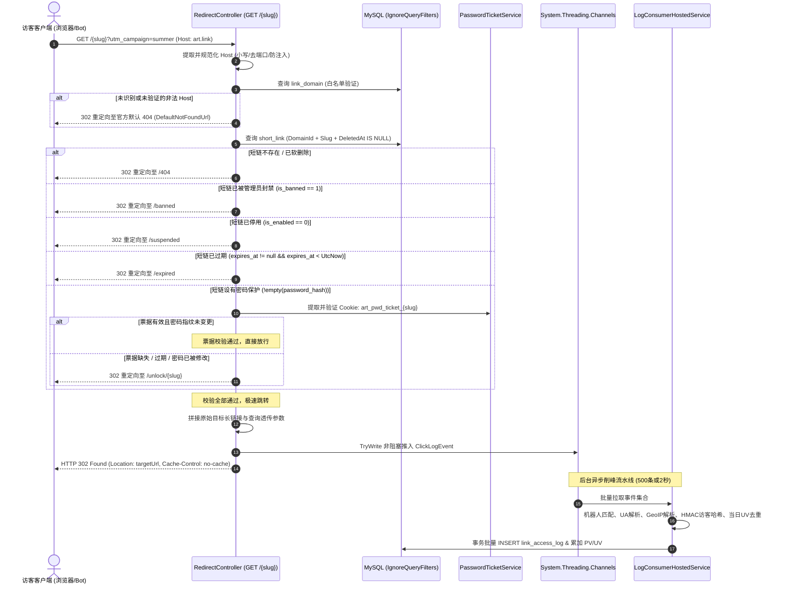

# Arturia.ShortLink - 后端阶段四详细设计说明书 (Phase 4: High-Performance 302 Redirect & Channels In-Process Consumption)

本文档是 **Arturia.ShortLink** 平台后端阶段四的核心架构设计与工程实操蓝图，专为**专职后端 AI Agent** 编写。  
后端 Agent 在独立会话中承接本阶段时，以此文档作为唯一的技术与业务执行基准，遵循 Clean Architecture 四层分层、双模鉴权与 TDD 集成测试门禁，完成阶段四全部交付。

---

## 文档概述与修订记录

| 版本 | 修订日期 | 修订人 | 修订说明 |
| :--- | :--- | :--- | :--- |
| **v1.0.0** | 2026-09-20 | AI 代理 (Antigravity) | 基于 `/grill-me` 深度架构决议，输出后端阶段四端到端详细设计说明书（公网 `GET /{slug}` 极速 302 路由与防 Host 注入状态页重定向、密码短链 HMAC 凭据与 8 位指纹自失效、`System.Threading.Channels` 进程内异步削峰与事务批处理、内存 UV 字典启动预热与跨天轮转、轻量 UA 解析与 GeoIP 降级容错） |

---

## 1. 阶段目标与交付范围 (Objectives & Scope)

### 1.1 阶段核心目标
构建短链系统最核心的高并发公网跳转与异步日志落盘流水线：
1. **公网极速 302 重定向路由 (`GET /{slug}`)**：
   * 毫秒级跳转引擎：从规范化 `Request.Host` 与路径 `slug` 唯一定位短链；
   * 受控使用 `.IgnoreQueryFilters()` 穿透多租户隔离，显式补齐 `deleted_at IS NULL`；
   * 严格按“不存在/已删除 (404) → 封禁 (banned) → 停用 (suspended) → 过期 (expired) → 密码保护 (unlock)”的固定优先级执行状态检查；
   * 环境自适应重定向：开发环境跳转至前端调试端口（如 `http://localhost:5173/unlock/{slug}`），生产环境保持注册域名白标体验（如 `https://{Host}/...`），未知 Host 严格回退至官方 404，严防 Host Header 开放重定向注入；
   * 支持客户端查询参数与 UTM 透传拼接至最终长链接。
2. **密码保护短链与 HMAC-SHA256 签名票据闭环**：
   * 密码短链访问拦截并 302 重定向至 SPA `/unlock/{slug}`；
   * 落地无状态密码验证端点 `POST /api/v1/links/{slug}/unlock`（限流 10次/分/IP）；
   * 凭据防篡改与自失效机制：HMAC Ticket 包含 `{domainId}:{slug}:{pwdHash前8位}:{expiresAt}`，30 分钟滑动 TTL，写入 `art_pwd_ticket_{slug}` HttpOnly Cookie；若短链密码被修改或清除，旧票据瞬间自动失效，彻底消除 Redis 黑名单依赖。
3. **`System.Threading.Channels` 进程内异步削峰流水线**：
   * 单例有界通道 `Channel<ClickLogEvent>`（容量 50,000，`BoundedChannelFullMode.Wait`）；
   * 重定向方法在响应 302 前仅调用非阻塞 `_channel.Writer.TryWrite(event)`，端到端时延维持在微秒级；满载时自适应丢弃并记录丢弃计数指标，绝对不阻塞公网跳转。
4. **后台消费服务 (`LogConsumerHostedService`) 与事务性批处理**：
   * 批量阈值：累积达到 **500 条** 或达到 **2 秒** 定时器阈值时触发批处理；
   * 事务隔离与重试：单批次内 `link_access_log` 批量插入与 `short_link` 计数器（PV/UV）`ExecuteUpdateAsync` 累加纳入同一事务；遇到死锁或临时抖动支持指数退避重试（最多 3 次），故障降级报警且不崩溃 BackgroundService；
   * 优雅停机：收到 `StopAsync` 信号时通知通道完成并排空消费剩余批次。
5. **单机当日 UV 字典去重与服务重启预热**：
   * 访客指纹哈希：基于配置与 UTC 日期派生密钥计算 `HMAC-SHA256(规范化IP字节 + User-Agent)`；
   * 内存字典：`ConcurrentDictionary<string, byte>`，键名格式 `uv:{linkId}:{yyyyMMdd}:{visitorHash}`；
   * 启动预热：服务启动时异步执行只读查询，加载当日（UTC >= 00:00:00 且 `is_bot=0`）的 `(link_id, visitor_hash)` 集合重建内存字典，跨重启保持商业 UV 精确连续；
   * 每日清理：后台定时任务在 UTC 00:00 清理上一日过期的内存键并派生新日密钥。
6. **机器人识别与轻量 UA/GeoIP 异步富化**：
   * 机器人过滤：后台消费者匹配启用的 `bot_user_agent` 风险规则，标记 `is_bot=1` 及 `bot_name`；机器人流量正常允许 302 跳转并写入明细日志，但不累加短链商业 PV 与 UV；
   * 轻量 UA 解析：零外部大依赖内置解析器，产出设备类型（桌面端/移动端/平板端）、操作系统与浏览器；
   * GeoIP 容错降级：抽象 `IGeoLocationResolver`，超时或不可用时安全降级为“未知地域”，不得阻塞通道，不得导致落盘异常。

### 1.2 本阶段明确排除范围 (Out of Scope for Phase 4)
* 深度多维数据看板统计聚合接口（`GET /api/v1/analytics/*`，阶段五交付）；
* 自定义域名管理与 DnsClient.NET 真实 CNAME/TXT 探测（阶段五交付）；
* 关闭前端 Mock 引擎的全链路跨端集成联调（阶段五交付）；
* 分布式多节点 Redis / Kafka 削峰架构（商业 MVP 聚焦单机轻量化闭环，留待第二期演进）。

---

## 2. 核心架构设计与业务时序 (Architecture & Workflows)

### 2.1 公网短链极速 302 重定向时序流转



---

### 2.2 密码保护短链流转与防篡改凭据设计

访客在前端 SPA `/unlock/{slug}` 卡片输入密码后，调用解锁接口。

#### 2.2.1 HMAC Ticket 结构与密码版本指纹
为确保短链作者在控制台修改或清空密码时，已下发的放行 Cookie 能够**瞬时、自适应失效**且无需在内存中维护黑名单：
* **票据明文载荷 (Payload)**：
  `{domainId}:{slug}:{pwdHash8}:{expiresAtUnix}`
  * `domainId`：所属域名 ID（十进制字符串）；
  * `slug`：短链别名（大小写敏感）；
  * `pwdHash8`：当前短链 `password_hash` 的前 8 位字符（密码版本指纹）；
  * `expiresAtUnix`：UTC 过期时间戳（秒，发放时设为 `UtcNow.AddMinutes(30).ToUnixTimeSeconds()`）。
* **HMAC 签名**：
  使用 `HMACSHA256(payload, secretKey)` 计算签名（密钥由配置 `ShortLink:PasswordTicketSecret` 提供，未配置时从系统主密钥派生）；
* **完整 Ticket 格式**：
  `Base64Url(payload) + "." + Base64Url(signature)`；
* **校验逻辑**：
  1. 解码载荷，验证结构格式；
  2. 使用恒定时间算法（`CryptographicOperations.FixedTimeEquals`）校验签名；
  3. 校验 `expiresAtUnix > DateTimeOffset.UtcNow.ToUnixTimeSeconds()`；
  4. 比对载荷中的 `pwdHash8` 与当前数据库中该短链的 `password_hash[..8]`；
  5. 若短链已被移除密码，或密码被更新导致前 8 位不一致，立即判定票据无效。

#### 2.2.2 密码解锁端点规范 (`POST /api/v1/links/{slug}/unlock`)
* **路由**：`POST /api/v1/links/{slug}/unlock`；
* **鉴权策略**：允许公网匿名访问；挂载 `auth-unlock-limiter`（限制 10 次/分钟/IP）；
* **请求体**：
  ```json
  {
    "password": "user-input-password"
  }
  ```
* **Host 与短链唯一定位**：
  从 `Request.Host` 获取当前 Host，查询 `link_domain` 与 `short_link`（忽略多租户全局过滤，要求未软删除）；
* **密码匹配**：
  调用 `BCrypt.Verify(password, link.PasswordHash)`；若不匹配，返回 HTTP 400 Bad Request：
  ```json
  {
    "code": 400,
    "success": false,
    "message": "访问密码错误，请重新输入",
    "data": null
  }
  ```
* **成功响应与 Cookie 下发**：
  若密码正确，生成 30 分钟有效期的 HMAC Ticket；
  设置响应头 Cookie：
  `Set-Cookie: art_pwd_ticket_{slug}={ticket}; Path=/; Max-Age=1800; HttpOnly; SameSite=Lax`（生产环境根据 `IsHttps` 附加 `Secure`）；
  返回统一响应体：
  ```json
  {
    "code": 200,
    "success": true,
    "message": "解锁成功",
    "data": {
      "originalUrl": "https://example.com/target-page",
      "ticket": "eyJhbGciOi..."
    }
  }
  ```

---

### 2.3 `System.Threading.Channels` 削峰消费与批处理持久化

#### 2.3.1 通道配置与背压保护
* 初始化单例 `Channel<ClickLogEvent>.CreateBounded(new BoundedChannelOptions(50000) { FullMode = BoundedChannelFullMode.Wait })`；
* 重定向请求只调用 `_channelWriter.TryWrite(event)`：
  * 若队列未满，事件瞬间入队，耗时约为 1~5 微秒；
  * 若队列达到 50,000 条上限（极端突发洪峰或数据库卡顿），`TryWrite` 立即返回 `false`，自增原子指标 `Interlocked.Increment(ref _droppedEventsCounter)` 并记录脱敏告警，**绝对不阻塞公网 302 跳转**。

#### 2.3.2 批处理触发规则与事务持久化
后台消费者 `LogConsumerHostedService` 运行于独立后台线程中：
* **双触发条件**：
  1. **数量阈值**：从通道累积收集满 **500 条** 事件；
  2. **时间阈值**：距离上一次刷盘达到 **2 秒**（通过 `PeriodicTimer` 或 `CancellationTokenSource` 延迟触发）。
* **富化与去重计算**：
  针对该批次中的每条事件：
  1. 机器人判定：比对内存缓存中的 `RiskRule`（`rule_type = bot_user_agent`）；
  2. 客户端特征解析：内置解析器解析 `DeviceType`（桌面端/移动端/平板端）、`Os`、`Browser`；
  3. 地域探测：调用 `IGeoLocationResolver`，遇超时或私网 IP 降级为“未知”；
  4. 计算访客哈希：`visitorHash = HMAC-SHA256(ipBytes + uaBytes, dailySalt)`；
  5. 当日 UV 去重：若非机器人，检查 `_uvDict.TryAdd($"uv:{linkId}:{yyyyMMdd}:{visitorHash}", 0)`。若返回 `true`，计入本次批次该短链的 `uvDelta`；所有非机器人事件均计入 `pvDelta`；
  6. 组装 `LinkAccessLog` 实体。
* **事务落盘与重试机制**：
  1. 开启 EF Core 数据库事务 `using var transaction = await dbContext.Database.BeginTransactionAsync(ct)`；
  2. `await dbContext.LinkAccessLogs.AddRangeAsync(batchLogs, ct)`；
  3. `await dbContext.SaveChangesAsync(ct)`；
  4. 按 `linkId` 聚合汇总 `pvDelta` 与 `uvDelta`，执行原子更新：
     ```csharp
     foreach (var (linkId, (pv, uv)) in linkAggregations)
     {
         await dbContext.ShortLinks
             .Where(l => l.Id == linkId)
             .ExecuteUpdateAsync(s => s
                 .SetProperty(x => x.TotalClicks, x => x.TotalClicks + (ulong)pv)
                 .SetProperty(x => x.TotalUniqueVisitors, x => x.TotalUniqueVisitors + (ulong)uv), ct);
     }
     ```
  5. 提交事务 `await transaction.CommitAsync(ct)`；
  6. **容灾退避**：若在保存或更新过程中遇到 MySQL 锁竞争或瞬态异常，采用指数退避（50ms, 100ms, 200ms）最多重试 3 次；若最终依然失败，记录结构化错误日志并安全丢弃，不导致后台托管服务崩溃。

---

### 2.4 当日 UV 字典生命周期与启动预热算法

#### 2.4.1 访客哈希计算算法
* **密钥安全性**：每日派生独立的 `dailySalt = HMAC-SHA256(SystemSalt, "yyyy-MM-dd")`；
* **哈希输入**：
  将 IP 地址解析为规范字节数组（IPv4 4 字节，IPv6 16 字节），后接 `Encoding.UTF8.GetBytes(userAgent ?? "")`；
* **哈希输出**：
  计算 `HMACSHA256(dailySalt, inputBytes)`，转为 64 位小写十六进制字符串存储于 `visitor_hash`。

#### 2.4.2 服务启动预热与每日轮转
* **启动预热 (`StartAsync`)**：
  在 `LogConsumerHostedService` 启动时，开启独立 Scope 异步执行：
  ```sql
  SELECT link_id, visitor_hash 
  FROM link_access_log 
  WHERE created_at >= @TodayUtcMidnight AND is_bot = 0;
  ```
  遍历结果集，填充至内存字典 `_uvDict.TryAdd($"uv:{linkId}:{todayStr}:{hash}", 0)`。
  *效果*：即使应用因发版或故障重启，当天已访问过的访客在重启后再次访问时，依然能准确被识别为老访客，单机商业 UV 计数绝对精确。
* **每日 UTC 00:00 轮转清理**：
  后台定时器检测到 UTC 日期变更时：
  1. 派生生成新日期的 `dailySalt`；
  2. 遍历 `_uvDict` 的 Key，将不以当前 `todayStr` 开头的历史键一律移除，释放内存。

---

## 3. 详细接口设计与数据契约规范 (API Contracts & DTOs)

### 3.1 公网短链重定向 (`GET /{slug}`)
* **HTTP 请求方法**：`GET`；
* **路由规范**：`/{slug:regex(^[a-zA-Z0-9_-]{{3,32}}$)}`；
* **路径参数**：`slug`（短链别名，区分大小写）；
* **查询参数**：支持透传任意查询串（包括但不限于 UTM 参数、自定义渠道参数）；
* **鉴权要求**：完全匿名公网开放；
* **响应规范**：
  * 正常跳转：HTTP `302 Found`，`Location: <OriginalUrlWithMergedQuery>`，附加响应头：
    ```http
    Location: https://example.com/target?utm_source=twitter&promo=spring
    Cache-Control: no-cache, no-store, max-age=0, must-revalidate
    Pragma: no-cache
    ```
  * 状态异常重定向（均为 HTTP `302 Found`）：
    * 不存在/已软删除：`Location: {FrontendBaseUrl}/404`；
    * 已封禁：`Location: {FrontendBaseUrl}/banned`；
    * 已停用：`Location: {FrontendBaseUrl}/suspended`；
    * 已过期：`Location: {FrontendBaseUrl}/expired`；
    * 需密码：`Location: {FrontendBaseUrl}/unlock/{slug}`。

---

### 3.2 密码校验与票据下发接口 (`POST /api/v1/links/{slug}/unlock`)
* **HTTP 请求方法**：`POST`；
* **路由规范**：`/api/v1/links/{slug}/unlock`；
* **鉴权要求**：公网匿名开放（挂载 `auth-unlock-limiter`）；
* **请求体 (JSON)**：
  ```json
  {
    "password": "password123!"
  }
  ```
* **校验规则 (FluentValidation)**：
  * `Password`：必填，长度 1~64 字符。
* **成功响应体 (HTTP 200)**：
  ```json
  {
    "code": 200,
    "success": true,
    "message": "解锁成功",
    "data": {
      "originalUrl": "https://dotnet.microsoft.com/download/dotnet/10.0",
      "ticket": "eyJkb21haW5JZCI6IjEiLCJzbHVnIjoidGVzdCJ9..."
    }
  }
  ```
* **响应头 Cookie**：
  ```http
  Set-Cookie: art_pwd_ticket_{slug}=<ticket>; Path=/; Max-Age=1800; HttpOnly; SameSite=Lax
  ```
* **失败响应体 (HTTP 400)**：
  ```json
  {
    "code": 400,
    "success": false,
    "message": "访问密码错误，请重新输入",
    "data": null
  }
  ```
* **不存在或已失效 (HTTP 404)**：
  ```json
  {
    "code": 404,
    "success": false,
    "message": "短链不存在或已失效",
    "data": null
  }
  ```

---

## 4. 关键类型、接口与类定义 (Type & Class Specifications)

### 4.1 领域与通道模型 (`Domain` / `Application`)

```csharp
// Arturia.ShortLink.Domain/Common/ClickLogEvent.cs
namespace Arturia.ShortLink.Domain.Common;

public sealed record ClickLogEvent(
    ulong LinkId,
    ulong WorkspaceId,
    string IpAddress,
    string? UserAgent,
    string? Referer,
    DateTime CreatedAtUtc,
    string? UtmSource,
    string? UtmMedium,
    string? UtmCampaign,
    string? UtmTerm,
    string? UtmContent
);
```

```csharp
// Arturia.ShortLink.Application.Common.Interfaces/IChannelLogWriter.cs
namespace Arturia.ShortLink.Application.Common.Interfaces;

public interface IChannelLogWriter
{
    bool TryWrite(ClickLogEvent logEvent);
    long DroppedEventsCount { get; }
}
```

```csharp
// Arturia.ShortLink.Application.Links.Interfaces/IPasswordTicketService.cs
namespace Arturia.ShortLink.Application.Links.Interfaces;

public interface IPasswordTicketService
{
    string GenerateTicket(ulong domainId, string slug, string passwordHash, DateTimeOffset expiresAt);
    bool ValidateTicket(string? ticket, ulong domainId, string slug, string? passwordHash);
}
```

```csharp
// Arturia.ShortLink.Application.Common.Interfaces/IUserAgentParser.cs
namespace Arturia.ShortLink.Application.Common.Interfaces;

public record UserAgentInfo(string DeviceType, string Os, string Browser);

public interface IUserAgentParser
{
    UserAgentInfo Parse(string? userAgent);
}
```

```csharp
// Arturia.ShortLink.Application.Common.Interfaces/IGeoLocationResolver.cs
namespace Arturia.ShortLink.Application.Common.Interfaces;

public record GeoLocationResult(string Country, string Region, string City);

public interface IGeoLocationResolver
{
    ValueTask<GeoLocationResult> ResolveAsync(string ipAddress, CancellationToken ct = default);
}
```

---

### 4.2 基础设施实现 (`Infrastructure`)

#### 4.2.1 通道写入实现 (`ChannelLogWriter`)
```csharp
// Arturia.ShortLink.Infrastructure.Channels/ChannelLogWriter.cs
namespace Arturia.ShortLink.Infrastructure.Channels;

public sealed class ChannelLogWriter : IChannelLogWriter
{
    private readonly Channel<ClickLogEvent> _channel;
    private long _droppedEventsCount;

    public ChannelLogWriter(Channel<ClickLogEvent> channel)
    {
        _channel = channel;
    }

    public long DroppedEventsCount => Interlocked.Read(ref _droppedEventsCount);

    public bool TryWrite(ClickLogEvent logEvent)
    {
        if (_channel.Writer.TryWrite(logEvent))
        {
            return true;
        }

        Interlocked.Increment(ref _droppedEventsCount);
        return false;
    }
}
```

#### 4.2.2 密码票据防篡改服务 (`PasswordTicketService`)
```csharp
// Arturia.ShortLink.Infrastructure.Services/PasswordTicketService.cs
namespace Arturia.ShortLink.Infrastructure.Services;

public sealed class PasswordTicketService : IPasswordTicketService
{
    private readonly byte[] _secretBytes;

    public PasswordTicketService(IConfiguration configuration)
    {
        var secret = configuration["ShortLink:PasswordTicketSecret"] 
            ?? configuration["Jwt:SecretKey"] 
            ?? "ArturiaShortLinkDefaultSecretKeyForPasswordTicketsAtLeast32Bytes!";
        _secretBytes = Encoding.UTF8.GetBytes(secret);
    }

    public string GenerateTicket(ulong domainId, string slug, string passwordHash, DateTimeOffset expiresAt)
    {
        var pwdHash8 = passwordHash.Length >= 8 ? passwordHash[..8] : passwordHash;
        var payload = $"{domainId}:{slug}:{pwdHash8}:{expiresAt.ToUnixTimeSeconds()}";
        var payloadBytes = Encoding.UTF8.GetBytes(payload);
        var signatureBytes = HMACSHA256.HashData(_secretBytes, payloadBytes);
        
        return $"{Base64UrlEncoder.Encode(payloadBytes)}.{Base64UrlEncoder.Encode(signatureBytes)}";
    }

    public bool ValidateTicket(string? ticket, ulong domainId, string slug, string? passwordHash)
    {
        if (string.IsNullOrWhiteSpace(ticket) || string.IsNullOrWhiteSpace(passwordHash))
            return false;

        var parts = ticket.Split('.');
        if (parts.Length != 2)
            return false;

        try
        {
            var payloadBytes = Base64UrlEncoder.DecodeBytes(parts[0]);
            var expectedSignature = HMACSHA256.HashData(_secretBytes, payloadBytes);
            var actualSignature = Base64UrlEncoder.DecodeBytes(parts[1]);

            if (!CryptographicOperations.FixedTimeEquals(expectedSignature, actualSignature))
                return false;

            var payload = Encoding.UTF8.GetString(payloadBytes);
            var fields = payload.Split(':');
            if (fields.Length != 4)
                return false;

            var ticketDomainId = ulong.Parse(fields[0]);
            var ticketSlug = fields[1];
            var ticketPwdHash8 = fields[2];
            var ticketExpiresAt = long.Parse(fields[3]);

            if (ticketDomainId != domainId || !string.Equals(ticketSlug, slug, StringComparison.Ordinal))
                return false;

            var currentPwdHash8 = passwordHash.Length >= 8 ? passwordHash[..8] : passwordHash;
            if (!string.Equals(ticketPwdHash8, currentPwdHash8, StringComparison.Ordinal))
                return false;

            return ticketExpiresAt > DateTimeOffset.UtcNow.ToUnixTimeSeconds();
        }
        catch
        {
            return false;
        }
    }
}
```

#### 4.2.3 轻量客户端 UA 解析器 (`UserAgentParser`)
```csharp
// Arturia.ShortLink.Infrastructure.Services/UserAgentParser.cs
namespace Arturia.ShortLink.Infrastructure.Services;

public sealed class UserAgentParser : IUserAgentParser
{
    public UserAgentInfo Parse(string? userAgent)
    {
        if (string.IsNullOrWhiteSpace(userAgent))
            return new UserAgentInfo("桌面端", "其他", "其他");

        var ua = userAgent;

        // 设备类型
        var deviceType = "桌面端";
        if (ua.Contains("iPad", StringComparison.OrdinalIgnoreCase) || 
            ua.Contains("Tablet", StringComparison.OrdinalIgnoreCase))
        {
            deviceType = "平板端";
        }
        else if (ua.Contains("Mobile", StringComparison.OrdinalIgnoreCase) || 
                 ua.Contains("Android", StringComparison.OrdinalIgnoreCase) || 
                 ua.Contains("iPhone", StringComparison.OrdinalIgnoreCase))
        {
            deviceType = "移动端";
        }

        // 操作系统
        var os = "其他";
        if (ua.Contains("Windows", StringComparison.OrdinalIgnoreCase)) os = "Windows";
        else if (ua.Contains("iPhone", StringComparison.OrdinalIgnoreCase) || ua.Contains("iPad", StringComparison.OrdinalIgnoreCase)) os = "iOS";
        else if (ua.Contains("Mac OS", StringComparison.OrdinalIgnoreCase) || ua.Contains("Macintosh", StringComparison.OrdinalIgnoreCase)) os = "macOS";
        else if (ua.Contains("Android", StringComparison.OrdinalIgnoreCase)) os = "Android";
        else if (ua.Contains("Linux", StringComparison.OrdinalIgnoreCase)) os = "Linux";

        // 浏览器
        var browser = "其他";
        if (ua.Contains("Edg/", StringComparison.OrdinalIgnoreCase)) browser = "Edge";
        else if (ua.Contains("Chrome/", StringComparison.OrdinalIgnoreCase)) browser = "Chrome";
        else if (ua.Contains("Safari/", StringComparison.OrdinalIgnoreCase) && !ua.Contains("Chrome/", StringComparison.OrdinalIgnoreCase)) browser = "Safari";
        else if (ua.Contains("Firefox/", StringComparison.OrdinalIgnoreCase)) browser = "Firefox";

        return new UserAgentInfo(deviceType, os, browser);
    }
}
```

#### 4.2.4 默认 GeoIP 降级解析器 (`DefaultGeoLocationResolver`)
```csharp
// Arturia.ShortLink.Infrastructure.Services/DefaultGeoLocationResolver.cs
namespace Arturia.ShortLink.Infrastructure.Services;

public sealed class DefaultGeoLocationResolver : IGeoLocationResolver
{
    public ValueTask<GeoLocationResult> ResolveAsync(string ipAddress, CancellationToken ct = default)
    {
        if (string.IsNullOrWhiteSpace(ipAddress) ||
            ipAddress == "127.0.0.1" || 
            ipAddress == "::1" || 
            ipAddress.StartsWith("192.168.") || 
            ipAddress.StartsWith("10."))
        {
            return ValueTask.FromResult(new GeoLocationResult("本地/内网", "未知", "未知"));
        }

        // MVP 默认降级实现，后续集成离线 IP 库
        return ValueTask.FromResult(new GeoLocationResult("未知", "", ""));
    }
}
```

---

## 5. 控制器与路由落地细节 (Api Layer)

### 5.1 `RedirectController` 实现细则
* **类特性与路由**：
  ```csharp
  [AllowAnonymous]
  [ApiExplorerSettings(IgnoreApi = true)] // 不污染管理端 Scalar API 目录
  public sealed class RedirectController : ControllerBase
  {
      [HttpGet("/{slug:regex(^[a-zA-Z0-9_-]{{3,32}}$)}")]
      public async Task<IActionResult> RedirectToTarget(
          [FromRoute] string slug,
          [FromServices] AppDbContext db,
          [FromServices] IChannelLogWriter channelWriter,
          [FromServices] IPasswordTicketService ticketService,
          [FromServices] IConfiguration config,
          CancellationToken ct)
  ```
* **状态页重定向目标解析器**：
  开发环境读取 `Frontend:BaseUrl`（例如 `http://localhost:5173`）；
  生产环境优先使用请求合法 Host `https://{Host}` 拼接相对路径；
  未识别 Host 回退至配置中的 `Platform:DefaultNotFoundUrl`；
* **查询参数合并 (Query Merging)**：
  访客请求中若包含额外 query（如 `?utm_campaign=winter&click_id=987`），自动与短链原始 `OriginalUrl` 的现有 Query 参数合并（访客携带的参数优先覆盖相同键），产出最终的目标跳转 URL；
* **非阻塞通道写入**：
  组装 `ClickLogEvent`，调用 `channelWriter.TryWrite(event)`；
* **响应输出**：
  ```csharp
  Response.Headers.CacheControl = "no-cache, no-store, max-age=0, must-revalidate";
  Response.Headers.Pragma = "no-cache";
  return Redirect(finalTargetUrl);
  ```

### 5.2 密码解锁端点实现
在 `LinksController` 中新增端点：
```csharp
[HttpPost("/api/v1/links/{slug}/unlock")]
[AllowAnonymous]
[EnableRateLimiting("auth-unlock-limiter")]
public async Task<ActionResult<ApiResponse<UnlockLinkResultDto>>> UnlockLink(
    [FromRoute] string slug,
    [FromBody] UnlockLinkCommand command,
    [FromServices] AppDbContext db,
    [FromServices] IPasswordTicketService ticketService,
    CancellationToken ct)
```

---

## 6. 自动化集成测试设计与质量门禁 (Integration Tests)

必须编写以下集成测试用例（位于 `Arturia.ShortLink.IntegrationTests`）：

| 测试类 / 方法 | 验证场景 | 预期断言 |
| :--- | :--- | :--- |
| `Redirect_ActiveLink_Returns302_AndLogsEvent` | 访问正常短链 `GET /{slug}` | 返回 HTTP 302；`Location` 为目标长链接；包含 `no-cache` 头；Channel 收到事件 |
| `Redirect_WithExtraQueryParams_MergesTargetUrl` | 访问 `GET /{slug}?promo=spring&utm_source=custom` | 返回 HTTP 302；`Location` 成功合并新老 query 参数 |
| `Redirect_NotFoundOrDeleted_RedirectsTo404` | 访问不存在或软删除的 slug | 返回 HTTP 302；`Location` 指向 `/404` 页面 |
| `Redirect_BannedLink_RedirectsToBannedPage` | 访问 `is_banned = 1` 的短链 | 返回 HTTP 302；`Location` 指向 `/banned` 页面 |
| `Redirect_SuspendedLink_RedirectsToSuspendedPage`| 访问 `is_enabled = 0` 的短链 | 返回 HTTP 302；`Location` 指向 `/suspended` 页面 |
| `Redirect_ExpiredLink_RedirectsToExpiredPage` | 访问已过期的短链 | 返回 HTTP 302；`Location` 指向 `/expired` 页面 |
| `Redirect_PasswordProtected_NoCookie_RedirectsToUnlock` | 设有密码但无 Cookie 访问 | 返回 HTTP 302；`Location` 指向 `/unlock/{slug}` |
| `Unlock_WrongPassword_Returns400` | 输入错误密码调用解锁端点 | 返回 HTTP 400；提示密码错误；未下发 Cookie |
| `Unlock_CorrectPassword_Returns200_SetsCookie` | 输入正确密码调用解锁端点 | 返回 HTTP 200；包含 `originalUrl` 和 `ticket`；下发 `art_pwd_ticket_{slug}` Cookie |
| `Redirect_PasswordProtected_WithValidCookie_Returns302` | 携带有效 Cookie 访问密码短链 | 返回 HTTP 302 直接跳转至长链接，不重定向至 unlock |
| `PasswordTicket_TamperedOrChanged_FailsValidation` | 篡改 Ticket 签名或短链密码被修改后 | `ValidateTicket` 返回 false，访问短链重新拦截至 unlock |
| `LogConsumer_DeduplicatesUv_OnSameVisitor` | 同一访客多次并发请求相同短链 | `link_access_log` 写入多条；`short_link.total_clicks` 累加 N；`total_unique_visitors` 仅累加 1 |
| `LogConsumer_BotTraffic_ExcludedFromCommercialStats` | 携带机器人 UA 请求短链 | 成功 302 跳转；日志 `is_bot = 1`；`total_clicks` 与 `total_unique_visitors` 均不累加 |

---

## 7. 附录：专职后端开发 Agent 高精度执行 Prompt

```text
================================================================================
【后端开发 Agent 专职任务指示书 - 后端阶段四 (Phase 4)】
================================================================================

你现在是 Arturia.ShortLink 项目的【专职后端开发 Agent】。
当前 main 分支已 100% 达成阶段一、阶段二及阶段三的验收与合入，工作区纯净。
请你严格根据《docs/阶段详细设计/后端阶段四详细设计说明书.md》与《docs/后端功能开发清单.md》开展阶段四的全部落地实现。

【严格执行红线】
1. 严格遵循专职边界，100% 仅在 backend/ 目录与已批准的 docs/ 规范下工作，严禁修改前端代码；
2. 遵循资产双轨 PR 隔离规则：本说明书作为阶段专属资产，已就绪于工作区，直接随本次阶段特性分支提交推进，自测验收通过后在同一个阶段 PR 中统一合入 main；
3. 在获得用户明确同意前，绝对严禁执行 git commit 或 git push！

【标准实施流转步序】
步骤 0: 检查工作区状态，确保 main 最新，切出特性分支 feat/phase-4-redirect-and-channels
步骤 1: 研读阶段四详细设计说明书，明确 302 路由、HMAC 密码凭据、Channels 通道、后台消费 HostedService 与 UV 字典预热方案
步骤 2: 编码实施：
  - 领域与应用层：定义 ClickLogEvent、IChannelLogWriter、IPasswordTicketService、IUserAgentParser、IGeoLocationResolver、解锁 DTO；
  - 基础设施层：
    * 注册 Channel<ClickLogEvent> (容量 50000) 与 ChannelLogWriter；
    * 实现 PasswordTicketService（HMAC-SHA256 签名，载荷包含 pwdHash[..8] 指纹）；
    * 实现 UserAgentParser（轻量提取桌面端/移动端/平板端、OS、Browser）与 DefaultGeoLocationResolver；
    * 实现 LogConsumerHostedService（启动预热当日 UV 集合，每 500 条或 2 秒刷盘，事务性批量写入 link_access_log 并原子累加 PV/UV，包含指数退避容灾重试，机器人流量识别与过滤）；
  - 展示接入层：
    * 实现 RedirectController，路由 GET /{slug:regex(^[a-zA-Z0-9_-]{{3,32}}$)}，执行 5 层优先级状态检查（404、封禁、停用、过期、密码Cookie），非阻塞 TryWrite 投递通道，输出 Location 与 Cache-Control: no-cache；
    * 在 LinksController 增加 POST /api/v1/links/{slug}/unlock 接口，校验密码并下发 Cookie；
步骤 3: 自动化测试：
  - 在 Arturia.ShortLink.IntegrationTests 编写并补充阶段四全部集成测试（覆盖正常跳转、Query合并、404/封禁/停用/过期状态页、密码解锁与Cookie放行、密码修改后旧票据自失效、通道批量消费、当日UV去重、机器人流量过滤）；
  - 运行 dotnet tool restore、locked restore、Release build、test 与 dotnet format --verify-no-changes，确保全部通过、0 报错 0 警告；
步骤 4: 启动 Kestrel 并调用 Start-Process 打开 Scalar 文档供人工审阅体验；
步骤 5: 停下操作，向用户汇报阶段四完成成果，等待用户确认；
步骤 6: 用户确认同意后，勾选《后端功能开发清单.md》阶段四子项、更新修订记录、更新 AGENTS.md 文首当前进度摘要，复跑门禁，提交推送特性分支，并通过 gh pr create / gh pr merge 自动合入 main，切回 main 验净后原地暂停！
================================================================================
```
